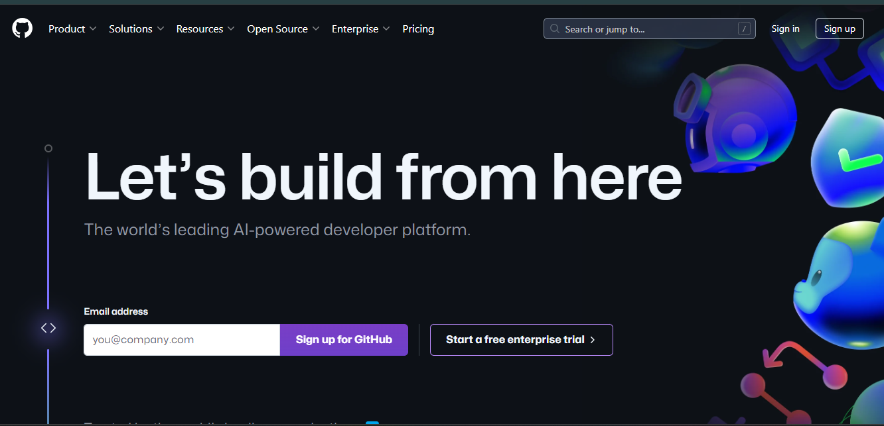
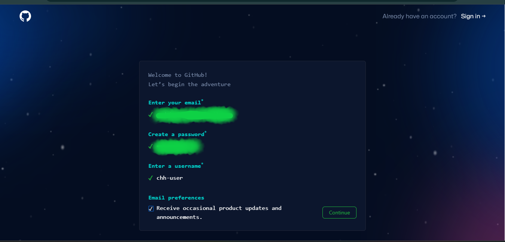
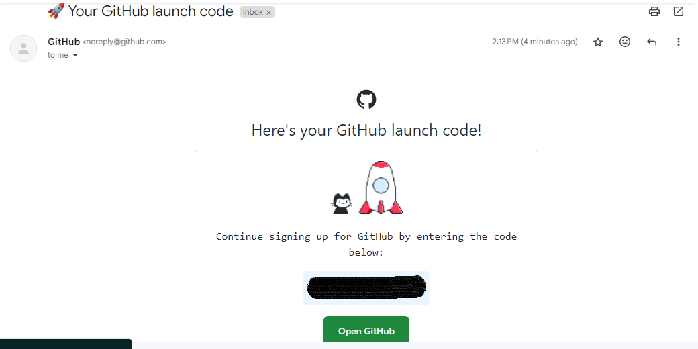
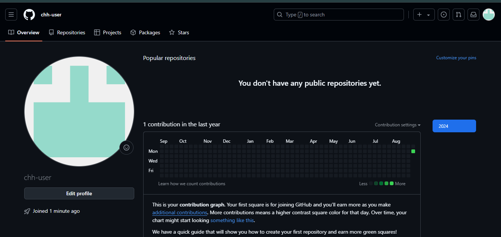
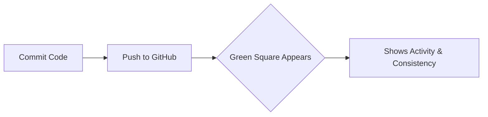

If **Git** is the engine, **GitHub** is the fuel station and the social network for developers. To contribute to **CodeHarborHub** projects, participate in Open Source, or host your portfolio, you need a GitHub account.

**To get started with GitHub, you need to create a GitHub account. If you already have a GitHub account, you can skip this step.**

<AdsComponent />

 

## Step 1: The Sign-Up Process

1. Go to [GitHub](https://github.com/) and click on the "Sign up" button.

    <BrowserWindow url="https://github.com" bodyStyle={{ padding: 0 }}>
      
    </BrowserWindow>

2. Enter your email address, choose a username, and create a password.

    <BrowserWindow url="https://github.com" bodyStyle={{ padding: 0 }}>
      
    </BrowserWindow>

3. Click on the "Create account" button.
4. Verify your email address.

    You will receive an email from GitHub with a link to verify your email address. Click on the link to verify your email address.

    <BrowserWindow url="https://mail.google.com/mail/u/..." bodyStyle={{ padding: 0 }}>
      
    </BrowserWindow>

5. Congratulations! You now have a GitHub account.
   
   <BrowserWindow url="https://github.com/chh-user" bodyStyle={{ padding: 0 }}>
      
    </BrowserWindow>

Now that you have created a GitHub account, you can start using GitHub to collaborate with others, contribute to open-source projects, and build your portfolio.

## Step 2: Setting Up a Professional Profile

At **CodeHarborHub**, we want your profile to look "Industrial Level" from Day 1. Recruiters look at your GitHub before they look at your Resume!

### Essential Profile Checklist:

* **Profile Picture:** Use a clear, professional headshot.
* **Bio:** Write a one-sentence summary of who you are.
    * *Example: "Full-Stack Developer | Founder of CodeHarborHub | Passionate about Open Source."*
* **Location:** Add your city/country (e.g., Madhya Pradesh, India).
* **Social Links:** Link your LinkedIn, Twitter, or personal portfolio website.

### Understanding the "Green Squares"

Once your account is created, you will see a grid called the **Contribution Graph**.

These squares represent your hard work. The more you code and contribute to projects like **CodeHarborHub**, the greener your graph becomes! Recruiters love to see a consistent contribution graph because it shows dedication and passion for coding.

## Step 3: Enabling 2FA (Security)

Security is a core DevOps principle. GitHub now requires **Two-Factor Authentication (2FA)** for all active developers.

1.  Click your profile picture $\rightarrow$ **Settings**.
2.  Go to **Password and Authentication**.
3.  Click **Enable two-factor authentication**.
4.  Use an app like **Google Authenticator** or **Authy**.

:::danger Safety First
Download your **Recovery Codes** and save them in a secure place (like Google Drive or a physical notebook). If you lose your phone and your codes, you lose your account forever!
:::

## Why GitHub is the "Developer's Portfolio"

| Feature | Why it matters to you |
| :--- | :--- |
| **Repositories** | Shows the world the projects you have built. |
| **Pull Requests** | Proves you can collaborate with other developers. |
| **Stars** | Like "Likes" for code—shows which projects are popular. |
| **Gists** | Great for sharing small snippets of code or notes. |

## Your First Task

1.  Create your account.
2.  Follow the **[CodeHarborHub Organization](https://github.com/codeharborhub)** on GitHub.
3.  Take a screenshot of your new profile and share it with the community!