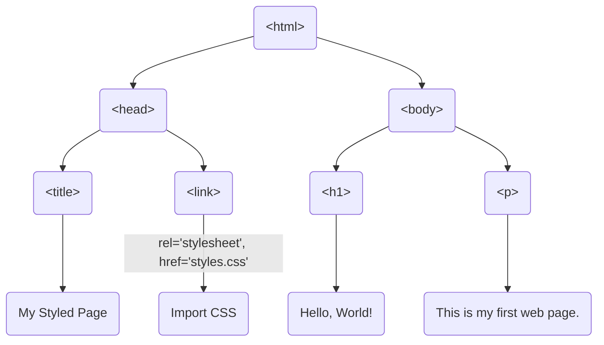
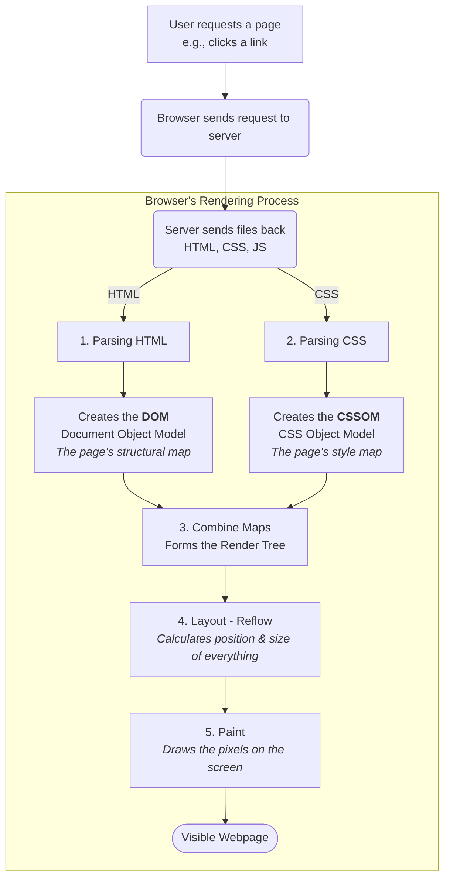

import thumbnail from '/img/tutorials/html/how-html-works.png';

<Image img={thumbnail} />

<br />

You've written your first HTML file, saved it, and opened it in your browser. But what's the magic that happens in that split second? How does a simple text file full of `<tags>` turn into a real webpage?

Think of your HTML file as a **blueprint** for a house. On its own, it's just a set of instructions on paper. The **web browser** (like Google Chrome, Firefox, or Safari) is the **construction crew**. Its job is to read your blueprint and build the actual house that people can see and interact with.

This process of reading code and turning it into a visual page is called **rendering**.

<AdsComponent />
<br />

## The 3-Step Process: From Code to Page

Even for a simple page, your browser follows a clear process when it opens your `index.html` file.

### Step 1: Parsing (Reading the Blueprint)

First, the browser reads your HTML document from top to bottom. It scans all the text and identifies all the HTML tags you've written, like `<html>`, `<head>`, `<h1>`, and `<p>`.

### Step 2: Building the DOM (Creating a Map)

This is the most important part. As the browser reads your tags, it builds an internal *map*, or *tree structure*, of your page. This map is called the **Document Object Model**, or **DOM** for short.

It's a "family tree" for your page:
* The `<html>` tag is the great-ancestor.
* The `<head>` and `<body>` tags are its children.
* The `<h1>` and `<p>` tags are children of the `<body>` tag.


This DOM is a live, in-memory representation of your HTML. It's not just text anymore; it's a structured object that the browser can work with.

### Step 3: Rendering (Painting the Page)

Once the browser has its DOM map, it starts "painting" the visual elements onto the screen. It goes through the DOM, node by node, and draws the `<h1>` as a large heading, the `<p>` as a paragraph, and so on.

<AdsComponent />
<br />

## HTML Doesn't Work Alone: The Teammates

Your HTML blueprint rarely works alone. A big part of its job is to tell the browser to pull in its teammates: CSS for styling, JavaScript for interactivity, and other resources like images.

### 1. CSS (The "Painter" and "Interior Decorator")

Your HTML provides the structure (the "walls"), but CSS provides the style (the "paint," "furniture," and "layout"). The `<link>` tag in your `<head>` tells the browser to fetch a CSS file and use its rules to style the DOM.

<Tabs>
  <TabItem value="HTML Code" label="HTML Code">
  
  ```html title="index.html"
    <!DOCTYPE html>
    <html>
    <head>
      <title>My Styled Page</title>
      <link rel="stylesheet" href="styles.css">
    </head>
    <body>
      <h1>Hello, World!</h1>
      <p>This is my first web page.</p>
    </body>
    </html>
```

</TabItem>
<TabItem value="CSS Code" label="CSS Code">

```css title="styles.css"
  body {
    font-family: Arial, sans-serif;
    background-color: #f9f9f9;
  }
  h1 {
    color: #333;
  }
  p {
    color: #666;
  }
```

</TabItem>
<TabItem value="Output On Browser" label="Output On Browser">
<BrowserWindow url="http://127.0.0.1:5500/index.html" bodyStyle={{fontFamily: "Arial, sans-serif", backgroundColor: "#f9f9f9"}}>
<h1 style={{color: "#333"}}>Hello, World!</h1>
<p style={{color: "#666"}}>This is my first web page.</p>
</BrowserWindow>
</TabItem>
<TabItem value="DOM Structure" label="DOM Structure">

Now, let's visualize the DOM structure that the browser creates from the HTML code:



This tree structure represents how the browser organizes the elements of your HTML document in memory. Each tag becomes a node in the tree, with parent-child relationships that reflect the nesting of elements in your HTML code. 

</TabItem>
</Tabs>

### 2. JavaScript (The "Electrician" and "Plumber")

JavaScript provides interactivity. If HTML is the walls and CSS is the paint, JavaScript is the "wiring" that makes the light switches work and the "plumbing" that makes the faucets run. The `<script>` tag tells the browser to fetch a JavaScript file and execute its code.

<Tabs>
<TabItem value="HTML Code" label="HTML Code">

```html title="index.html"
  <!DOCTYPE html>
  <html>
  <head>
    <title>My Interactive Page</title>
  </head>
  <body>
    <h1>Hello, World!</h1>
    <p id="demo"></p>
    
    <script src="script.js"></script>
  </body>
  </html>
```

</TabItem>
<TabItem value="JavaScript Code" label="JavaScript Code">

```javascript title="script.js"
  // This code finds the <p> with the id "demo"
  // and changes its content.
  document.getElementById("demo").innerHTML = "Hello, JavaScript!";
```

</TabItem>
<TabItem value="Output On Browser" label="Output On Browser">
<BrowserWindow url="http://127.0.0.1:5500/index.html">
<h1>Hello, World!</h1>
<p>Hello, JavaScript!</p>
</BrowserWindow>
</TabItem>
</Tabs>

### 3. Images and Media

Tags like `` tell the browser to make *another* request to fetch that image file and display it in the designated spot.

<Tabs>
<TabItem value="HTML Code" label="HTML Code">

```html title="index.html"
  <!DOCTYPE html>
  <html>
  <head>
    <title>My Page with an Image</title>
  </head>
  <body>
    <h1>Hello, World!</h1>
    
  </body>
  </html>
```

</TabItem>
<TabItem value="Output On Browser" label="Output On Browser">
<BrowserWindow url="http://127.0.0.1:5500/index.html">
<h1>Hello, World!</h1>

</BrowserWindow>
</TabItem>
</Tabs>


<AdsComponent />
<br />

:::tip How Browsers Render

When a browser receives an HTML file, it doesn't just "show" it. It follows a detailed, step-by-step process to build the page from the ground up. This is often called the **rendering pipeline**.

Here is a high-level look at the steps:



Let's break down what those terms mean:

1. **Parsing (Building the DOM & CSSOM):** The browser reads (parses) the HTML and builds a "map" of its structure. This map is called the DOM (Document Object Model). It's a live tree of all the elements on your page. It does the exact same thing for the CSS, creating a style map called the CSSOM.

2. **Render Tree:** The browser combines the DOM (the structure) and the CSSOM (the styles). This new tree knows what to display and what it should look like.

3. **Layout (or Reflow):** The browser calculates the exact size and position for every single element. It figures out, "This `<h1>` goes at the top, it's 32px tall and 500px wide. This `<p>` goes below it," and so on.

4. **Paint:** This is the final step. The browser takes the layout and "paints" the actual pixels onto your screen.
:::

## Conclusion

And that's the magic! It's not so magical after all. It's a clear, logical process:

1.  **HTML** is the **blueprint** that provides the structure.
2.  The **Browser** is the **builder** that reads this blueprint.
3.  It builds a **DOM** (an internal map).
4.  It brings in the teammates: **CSS** (for style) and **JavaScript** (for interaction).
5.  It **renders** (paints) the final, visual page by combining the HTML structure with the CSS rules.