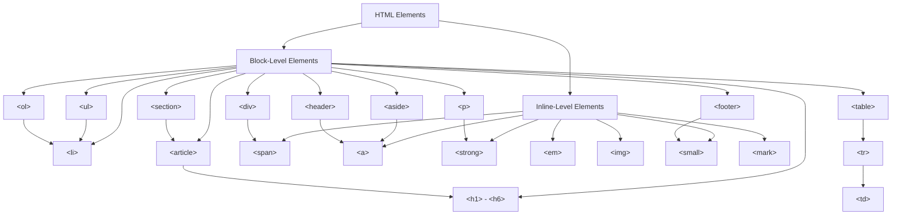

You know the rigid **syntax** and the required **structure** of an HTML file. Now it's time to fill that structure with actual content using a library of available elements.

In this tutorial, we will recap the difference between an element and a tag, and then dive into the most fundamental concept for layout: the difference between **block-level** and **inline** elements.

<AdsComponent />
<br />

---

## Elements vs. Tags (A Quick Recap)

While the terms "element" and "tag" are often used interchangeably, it's important to remember their precise roles:

* **Tag:** The actual markers used to define the element (e.g., the opening tag `<h1>` and the closing tag `</h1>`).
* **Content:** The information that lives inside the tags.
* **Element:** The complete unit, including the opening tag, content, and closing tag.

> **Example:** `<p>This is the content.</p>`
>
> * The entire thing is the **Element**.
> * `<p>` is the **Opening Tag**.
> * `</p>` is the **Closing Tag**.

---

## The Two Core Element Categories

Every HTML element falls into one of two main display categories, and understanding this distinction is key to controlling the layout of your webpage.

### 1. Block-Level Elements (The Containers)

**Block-level** elements are the structural bricks of a webpage. They control large parts of the content, like entire paragraphs, lists, or large divisions of a page.

* They always **start on a new line**.
* They naturally take up the **full available width** of their parent container (even if the content inside is narrow).
* They are designed to contain other block-level elements and inline elements.


| Element | Tag | Purpose | Analogy |
| :--- | :--- | :--- | :--- |
| **Heading** | `<h1>` through `<h6>` | Defines sections or titles. | Chapter headings. |
| **Paragraph** | `<p>` | Defines a block of text. | A separate paragraph in a book. |
| **Division** | `<div>` | A generic container used to group other elements for styling or layout. | A box used to separate sections. |
| **List** | `<ul>`, `<ol>`, `<li>` | Defines ordered and unordered lists. | A bulleted list. |

### 2. Inline Elements (The Text Markers)

**Inline** elements are designed to only mark up small, specific pieces of text *within* a larger block-level container (like a paragraph).

* They **do not start on a new line**.
* They only take up the **width necessary** to wrap their content.
* They cannot contain block-level elements; they only wrap text or other inline elements.

| Element | Tag | Purpose | Analogy |
| :--- | :--- | :--- | :--- |
| **Anchor** | `<a>` | Creates a hyperlink to another page or resource. | A footnote reference. |
| **Span** | `<span>` | A generic inline container used to apply a specific style to a small piece of text. | A highlighter pen on a single word. |
| **Strong/Emphasis** | `<strong>`, `<em>` | Indicates strong importance or emphasis (often rendered as bold or italic). | Bolding a key phrase. |

<AdsComponent />
<br />

:::tip

### Visual Representation of HTML Elements

The following diagram illustrates the relationship between different types of HTML elements:



:::


---

## Practical Comparison: Block vs. Inline Behavior

When building a page, you must know how these two element types behave next to each other.

### Code Example

In this example, notice how the block elements force a line break, while the inline elements flow naturally on the same line.

```html title="comparison.html"
<!DOCTYPE html>
<html lang="en">
<head>
    <title>Element Comparison</title>
</head>
<body>
    <div style="border: 2px solid blue; padding: 5px;">
        This is the start of a **DIV** (Block). It takes up the full width.
    </div>
    
    <p style="border: 2px solid red; padding: 5px;">
        This is a **Paragraph** (Block). It starts a new line and pushes the content after it onto another line.
    </p>

    This is regular text. 
    <span style="background-color: yellow;">This is a SPAN (Inline).</span>
    And this is more regular text.
    <a href="#">This is an A (Inline) link.</a>
</body>
</html>
```

### Browser Output

<BrowserWindow url="http://127.0.0.1:5500/comparison.html">
<div style={{border: "2px solid blue", padding:"5px", width: "100%"}}>
This is the start of a **DIV** (Block). It takes up the full width.
</div>

<p style={{border: "2px solid red", padding: "5px", width: "100%"}}>
This is a **Paragraph** (Block). It starts a new line and pushes the content after it onto another line.
</p>

<p>
This is regular text.
<span style={{backgroundColor: "yellow", color: "#333"}}>This is a SPAN (Inline).</span>
And this is more regular text.
<a href="#">This is an A (Inline) link.</a>
</p>
</BrowserWindow>

Notice in the output:

1.  The **DIV** and **Paragraph** elements are stacked vertically.
2.  The **SPAN** and **A** elements sit horizontally on the same line as the surrounding text.

-----

## Conclusion

The distinction between **block-level** and **inline** elements is foundational to web development. Block elements provide the primary structure and flow of the document (like `<div>` and `<h1>`), while inline elements provide specific context and formatting *within* that flow (like `<span>` and `<a>`).