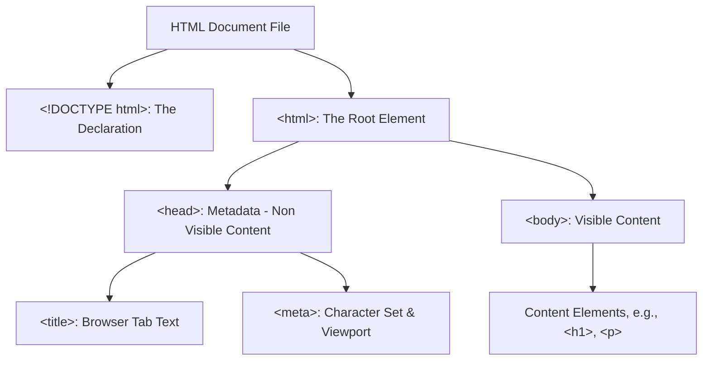

Every language, whether spoken or coded, has rules for how words are put together. These rules are called **syntax**. In HTML, the syntax dictates how you must arrange tags and elements for the browser to successfully read your webpage.

In this tutorial, we'll cover the fundamental structure required for every HTML file and break down the anatomy of a single element.

<AdsComponent />

<br />

---

## The Essential HTML Document Structure

Every standard HTML file must follow a specific, required structure. This structure, often called the **boilerplate**, defines the head (metadata) and the body (visible content) of your page.

```html title="index.html"
<!DOCTYPE html>
<html lang="en">
  <head>
    <meta charset="UTF-8" />
    <meta name="viewport" content="width=device-width, initial-scale=1.0" />
    <title>My First Page</title>
  </head>
  <body>
    </body>
</html>
```

### Visualizing the Structure

The following diagram illustrates the nested, hierarchical relationship of the main structural elements:



### Document Breakdown: `<head>` vs. `<body>`

The entire document is governed by a few critical opening tags:

  * **`<!DOCTYPE html>`**: This is the very first line and is not an HTML tag; it's an instruction to the browser, telling it to expect a modern HTML5 document.
  * **`<head>`**: This is the **non-visible** section of the page. It contains metadata—data *about* the HTML document—such as the character set, links to CSS files, and the page title that appears in the browser tab.
  * **`<body>`**: This is the **visible** section of the page. Everything inside the `<body>` is rendered to the screen for the user to see, including headings, paragraphs, images, and links.

<AdsComponent />

<br />

-----

## The Anatomy of an HTML Element

The **element** is the fundamental building block of HTML syntax. It is the complete unit of structure, consisting of opening and closing tags, content, and optional attributes.

### Elements, Tags, and Attributes

Every standard HTML element can be broken down into these three parts:

1.  **Opening Tag**: Marks where the element *begins*.
2.  **Content**: The text or other elements enclosed by the tags.
3.  **Closing Tag**: Marks where the element *ends* (distinguished by the forward slash `/`).

The entire unit, from the opening tag to the closing tag, is the **HTML Element**.

| Syntax Part | Description | Example |
| :--- | :--- | :--- |
| **Element** | The complete structural unit. | `<p class="intro">Content</p>` |
| **Tag** | The markers (`<p>` and `</p>`). | `<p>` |
| **Attribute** | Used inside the opening tag to provide extra information or modify the element (e.g., `class="intro"`). | `class="intro"` |

-----

### Understanding Attributes

**Attributes** are always placed inside the **opening tag** and provide extra information about the element that the user typically cannot see. They consist of a **name** and a **value**, separated by an equals sign and enclosed in quotation marks.

**Example of an element with attributes:**

```html
<a href="https://example.com)" target="_blank">Click here</a>
```

| Element/Tag | Attribute Name | Attribute Value | Purpose |
| :--- | :--- | :--- | :--- |
| `<a>` (Anchor Tag) | `href` | `"https://example.com"` | Specifies the destination URL. |
| `<a>` (Anchor Tag) | `target` | `"_blank"` | Specifies the link should open in a new tab. |

### Self-Closing (Void) Elements

Not all elements require a closing tag. Some elements, known as **void elements** or **self-closing elements**, only serve to embed content or provide metadata and do not wrap any text.

**Common Self-Closing Elements:**

  * **`<br>`**: Line break
  * **``**: Image
  * **`<meta>`**: Document metadata
  * **`<input>`**: Form input field

<!-- end list -->

```html

```

> **Note:** Although the slash (`/`) at the end of a self-closing tag (e.g., ``) is optional in modern HTML5, you will often see it used by convention.

<AdsComponent />
<br />

-----

## Practical Syntax in Action

When you combine the essential structure with specific elements, you create a fully functioning webpage. The browser reads the tags and renders the final result.

```html title="index.html"
<!DOCTYPE html>
<html lang="en">
  <head>
    <meta charset="UTF-8" />
    <meta name="viewport" content="width=device-width, initial-scale=1.0" />
    <title>Basic Structure Example</title>
  </head>
  <body>
    <h1>Hello, World!</h1>
    <p>Welcome to HTML learning. This text is inside a paragraph element.</p>
  </body>
</html>
```

### Browser Output

<BrowserWindow url="http://127.0.0.1:5500/index.html">
<>
<h1>Hello, World!</h1>
<p>Welcome to HTML learning.</p>
</>
</BrowserWindow>

The browser reads the rigid structure defined by the **syntax**—from the `<!DOCTYPE>` declaration down to the closing `</body>` tag—to successfully display the content defined in the **elements** within the body.

:::tip Explanation and Visual Representation

<br />

In the above code snippet of an HTML document, the following elements are used like:

<div style={{border: "1px solid #ccc", padding: "1rem", marginBottom: "1rem"}}>

&lt;!DOCTYPE html&gt;

&lt;html&gt;

  <div style={{border: "1px solid #ccc", padding: "1rem", margin: "0.5rem", marginBottom: "0.5rem"}}>
    
    &lt;head&gt;

    <div style={{border: "1px solid #ccc", padding: "1rem", margin: "0.5rem", marginBottom: "1rem"}}>

      &lt;meta charset="UTF-8" /&gt;

      &lt;meta name="viewport" content="width=device-width, initial-scale=1.0" /&gt;

      &lt;title&gt;My First Page&lt;/title&gt;

    </div>

  &lt;/head&gt;

  &lt;body&gt;

  <div style={{border: "1px solid #ccc", padding: "1rem", margin: "0.5rem", marginBottom: "0.5rem"}}>
    
    &lt;!-- Your content goes here --&gt;

    </div>

  &lt;/body&gt;

  </div>

  &lt;/html&gt;
</div>

<br />

Now, let's understand the elements used in the HTML document:

- **`<!DOCTYPE html>`**: Declares the document type and version of HTML.
- **`<html>`**: Root element that contains all other elements.
- **`<head>`**: Contains metadata about the document. It includes elements like `<meta>` and `<title>`.
- **`<meta charset="UTF-8" />`**: Specifies the character encoding of the document.
- **`<meta name="viewport" content="width=device-width, initial-scale=1.0" />`**: Sets the viewport properties for responsive design.
- **`<title>`**: Sets the title of the document (displayed in the browser tab).
- **`<body>`**: Contains the visible content of the document.
- **`<!-- Your content goes here -->`**: Represents a comment that is not displayed in the browser.

:::

-----

## Conclusion

Understanding the strict rules of **HTML syntax** and the required **document structure** is the foundation of web development. Remember that the entire page is built from nested **elements**, which consist of **tags**, and are often modified by **attributes**.