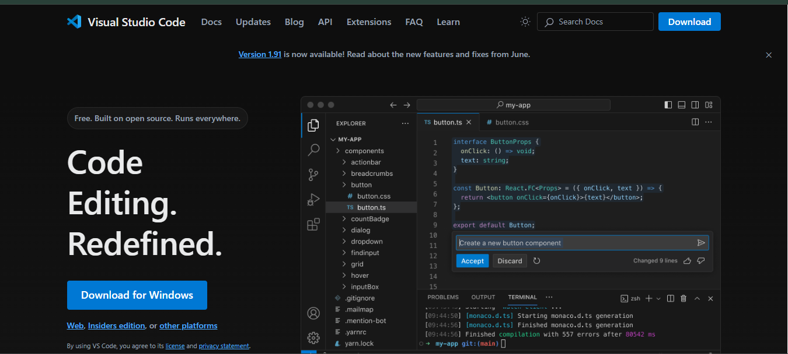
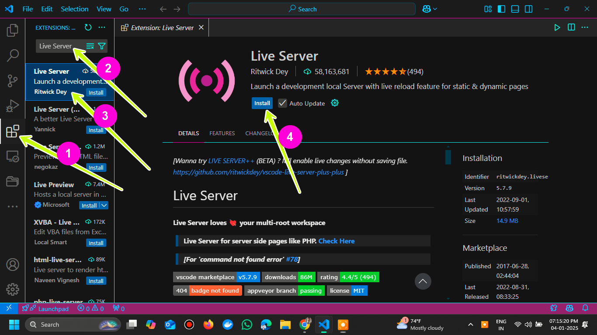
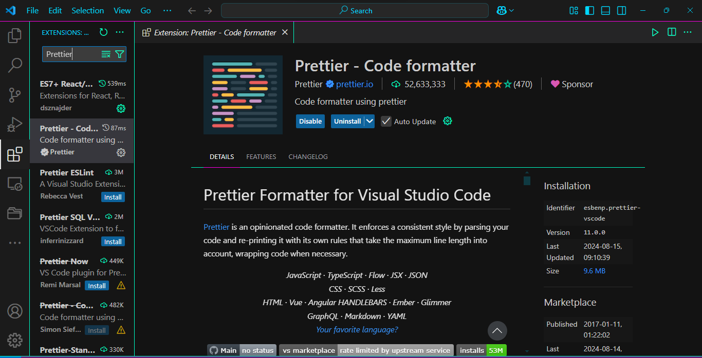

Before you can build a house, you need a good toolbox. The same goes for coding. To write HTML, you'll need a special program called a **code editor**.

Setting up this "development environment" is the most important first step. Having the right tools won't just make you more productive; it will make coding much more fun and a lot less frustrating.

In this tutorial, we'll cover what to look for in an editor and walk you through setting up **Visual Studio Code (VS Code)**, a free, popular, and powerful tool that's perfect for beginners and pros alike.

<AdsComponent />
<br />

## Why Not Just Use Notepad?

Technically, you *could* write HTML in a basic program like Notepad or TextEdit. But you'll quickly find it's a painful experience.

A proper code editor (or its bigger sibling, an **IDE** - Integrated Development Environment) is a text editor with superpowers designed specifically for programming.

### What Makes a Code Editor Great?

For writing HTML, here are the key features you'll come to love:

1.  **Syntax Highlighting:** This is the most obvious one. It makes your code colorful and easy to read by assigning different colors to tags, attributes, and text.
2.  **Auto-Completion:** The editor suggests code as you type, saving you from typos and from having to memorize every single HTML tag.
3.  **Live Preview:** Many editors can show you a live, in-browser preview of your webpage that automatically refreshes every time you save your file.
4.  **Extensions & Plugins:** This allows you to add *even more* features, like the "Live Preview" we just mentioned, code formatters, and support for other languages.

<AdsComponent />
<br />

## Our Top Recommendations

You'll find many great editors, but most developers today use one of these three.

* **1. Visual Studio Code (VS Code):** This is our top recommendation and the one we'll use for this tutorial. It's free, open-source, fast, and has a massive library of extensions for anything you can imagine. It's the industry standard for a reason.
* **2. Sublime Text:** An incredibly fast, simple, and lightweight editor. It's not free, but it offers an unlimited free trial. Many developers love its simplicity.
* **3. Atom:** Another free, open-source editor that is very "hackable" and easy to customize. It was developed by GitHub (and is now also owned by Microsoft, like VS Code).

For this tutorial, we're going to stick with **VS Code**.

<AdsComponent />
<br />

## Let's Install VS Code

Getting set up is a simple three-step process.

### Step 1: Download and Install VS Code

1.  Go to the official [Visual Studio Code website](https://code.visualstudio.com/).
2.  Download the correct installer for your operating system (Windows, macOS, or Linux).
3.  Run the installer and follow the on-screen instructions.

<BrowserWindow url="https://code.visualstudio.com/" bodyStyle={{padding: 0}}>
  [](https://code.visualstudio.com/)
</BrowserWindow>

### Step 2: Install Key Extensions

The real power of VS Code comes from its extensions. Let's install the most important one for HTML development.

1.  Open VS Code.
2.  Click on the **Extensions** icon in the sidebar (it looks like four squares).
3.  In the search bar, type **"Live Server"** and press Enter.
4.  Find the one by **Ritwick Dey**. Click the "Install" button.



**Live Server** is the extension that will launch a small local server and automatically reload your browser whenever you save your HTML file. It's a huge time-saver.

> **Optional (but recommended):** Also search for and install **"Prettier - Code formatter"**. This extension will automatically clean up and format your code to keep it neat and readable.
>
> 

### Step 3: Write Your First Page

1.  Create a new folder on your computer for your projects (e.g., `my-website`).
2.  In VS Code, go to `File` &rarr; `Open Folder...` and choose the folder you just created.
3.  In the VS Code "Explorer" sidebar, click the "New File" icon and name your file `index.html`.
4.  Copy and paste the following code into your new file:

```html title="index.html"
<!DOCTYPE html>
<html lang="en">
  <head>
    <meta charset="UTF-8" />
    <meta name="viewport" content="width=device-width, initial-scale=1.0" />
    <title>My First HTML Page</title>
  </head>
  <body>
    <h1>Hello, World!</h1>
    <p>This is my first HTML page using VS Code.</p>
  </body>
</html>
```

5.  **Save your file.** Now, right-click anywhere in your `index.html` file and select **"Open with Live Server"**.

Your default web browser will pop open, displaying your new webpage\!

<BrowserWindow url="http://localhost:5500/index.html">
<>
<h1>Hello, World!</h1>
<p>This is my first HTML page using VS Code.</p>
</>
</BrowserWindow>

Now, try changing the text inside the `<h1>` tag and save the file. You'll see the change appear in your browser instantly.

<AdsComponent />
<br />

## Conclusion

Congratulations! You've successfully set up a professional development environment. You now have a powerful code editor installed, just like the ones used to build the websites you use every day.