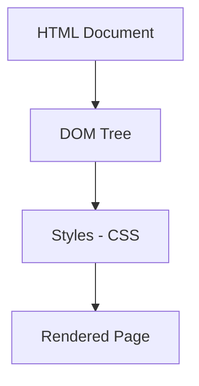
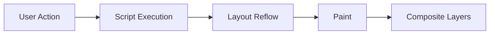

Modern web browsers come with a powerful suite of built-in tools known as **Developer Tools (DevTools)**. These tools help developers **inspect**, **debug**, **analyze**, and **optimize** web applications directly within the browser.

:::info
Think of DevTools as your web development Swiss Army knife — it provides everything you need to understand how a webpage works under the hood and fix issues on the fly.
:::

## What Are Browser DevTools?

**Browser DevTools** are a set of debugging tools integrated into browsers like **Chrome**, **Firefox**, **Edge**, and **Safari**. They allow you to view and interact with the **HTML**, **CSS**, **JavaScript**, **network requests**, and **performance metrics** of any webpage.

You can open DevTools by pressing:

* **Windows/Linux:** `Ctrl + Shift + I` or `F12`  
* **macOS:** `Cmd + Option + I`

## Core Panels in DevTools

Let’s explore the most important panels and their uses:

| Panel | Purpose | Example Use |
| ------ | -------- | ----------- |
| **Elements** | Inspect and modify HTML & CSS live | Change a button color or test responsive layout |
| **Console** | Run JavaScript commands & view logs/errors | `console.log()` debugging |
| **Network** | Monitor API calls, page load time, and caching | Analyze slow API responses |
| **Sources** | View and debug JavaScript files with breakpoints | Pause code at runtime |
| **Performance** | Analyze runtime performance and memory usage | Optimize page rendering |
| **Application** | View storage, cookies, and service workers | Inspect LocalStorage data |
| **Security** | Check HTTPS and certificate information | Identify mixed-content issues |
| **Lighthouse** | Generate audits for performance, SEO, and accessibility | Get site improvement recommendations |

## Elements Panel

The **Elements panel** allows you to explore and edit your website’s structure and styles in real-time.



**Example:**

Change the text of a heading directly from the DOM inspector — it won’t affect your source code, but helps test design changes instantly.


## Console Panel

The **Console** is your **interactive JavaScript terminal**. You can log data, test snippets, or view error messages.

```js title="Console"
console.log("Hello, CodeHarborHub!");
```

**Output:**

```
Hello, CodeHarborHub!
```

Common uses:

* Debugging JavaScript code  
* Monitoring warnings or errors  
* Inspecting objects and variables  

:::tip

You can also use the Console to execute JavaScript on the fly, making it a powerful tool for testing and debugging.

You can also use shortcuts like:
* `$0` → selects the last inspected element from the Elements panel  
* `clear()` → clears the console output  
:::


## Network Panel

The **Network panel** shows every HTTP request made by the browser — scripts, images, CSS, APIs, and more.

<Tabs>
  <TabItem value="what" label="What It Shows" default>
    * Request and response headers  
    * File sizes and load times  
    * Waterfall visualization of loading sequence  
    * Status codes (e.g., 200, 404, 500)  
  </TabItem>
  <TabItem value="why" label="Why It Matters">
    Helps identify slow resources, failed requests, or caching problems — key for improving **performance** and **user experience**.
  </TabItem>
</Tabs>

## Sources Panel

Use the **Sources panel** to:
* View and debug JavaScript files  
* Set **breakpoints**  
* Step through your code  
* Watch variable values as your script runs  

```jsx live
function DebugExample() {
  const [count, setCount] = React.useState(0);
  return (
    <div style={{ textAlign: "center" }}>
      <h3>Debug Counter Example</h3>
      <p>Count: {count}</p>
      <button onClick={() => setCount(count + 1)}>Increment</button>
    </div>
  );
}
```

Try adding a **breakpoint** on the `setCount` line in DevTools to pause execution and inspect the current state.

## Application Panel

The **Application panel** helps manage client-side storage and data.

You can inspect:
* **Cookies**
* **LocalStorage** / **SessionStorage**
* **IndexedDB**
* **Service Workers**
* **Cache Storage**
* **Manifest files**

This is extremely helpful for debugging **PWAs (Progressive Web Apps)** or authentication tokens.

## Performance Panel

The **Performance** tab allows you to **record runtime activity** — useful for diagnosing rendering issues and JavaScript bottlenecks.

Key metrics include:
* Frame rendering time  
* Layout and paint events  
* JavaScript execution time  
* Memory usage  



A well-optimized page maintains **60 frames per second (FPS)** for smooth performance.

:::info

Think of the Performance panel as a high-speed camera that captures every millisecond of your webpage’s activity, allowing you to pinpoint exactly where delays occur.

:::


## Lighthouse Audits

The **Lighthouse** tool (under the “Audits” or “Lighthouse” panel) evaluates your web app for:
* Performance  
* Accessibility  
* SEO  
* Progressive Web App (PWA) features  

It provides actionable reports with scores and recommendations.

## Example: Inspecting a Button

```html
<button class="cta">Click Me</button>
```

In the **Elements panel**, you can:
* Modify the color dynamically  
* Add hover states  
* Copy computed CSS styles  

Then test the interaction directly without editing the source code.

## Math Behind Load Time (KaTeX Example)

If a page loads 3 MB of data in 6 seconds:

$$
Load\ Speed = \frac{3\ \text{MB}}{6\ \text{s}} = 0.5\ \text{MB/s}
$$

Optimizing image size, caching, and lazy loading can drastically reduce this time.

## Best Practices for Using DevTools

* Use **Console logs** for quick debugging, but remove them before production.  
* Check **Network requests** for unnecessary files or slow APIs.  
* Run **Lighthouse** regularly for performance improvements.  
* Monitor **Memory leaks** using the Performance tab.  
* Use **Responsive Design Mode** to test across devices.  

## Key Takeaways

* DevTools empower you to **inspect, debug, and optimize** web applications.  
* Mastering key panels (Elements, Console, Network) saves hours of debugging.  
* Tools like **Lighthouse** and **Performance** enhance web speed and accessibility.  
* DevTools are your **real-time lab** for frontend development.

:::tip Try It Yourself

Open DevTools on any website and experiment with the panels discussed. Change styles, debug scripts, and analyze network requests to see how they affect the page in real-time!

:::