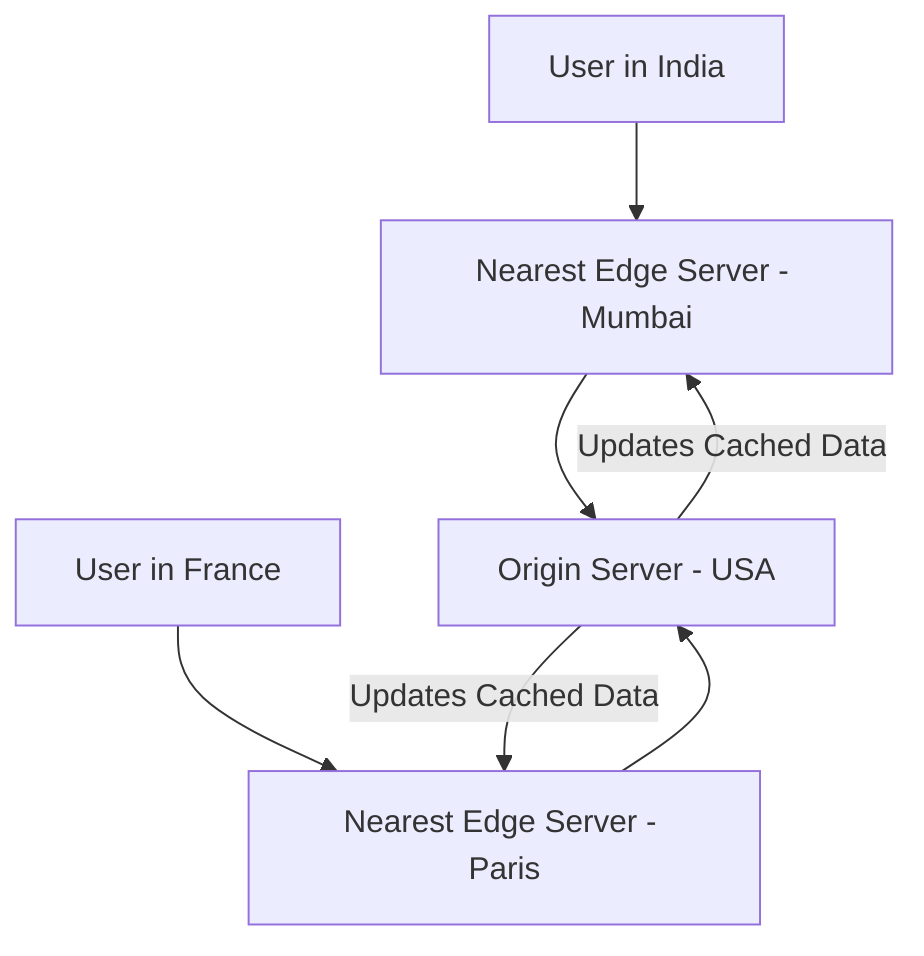
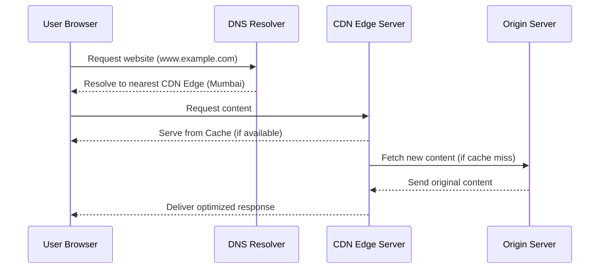

Modern websites and apps serve millions of users worldwide but sending data directly from one central server to everyone would be slow and inefficient. That’s where **CDNs (Content Delivery Networks)** come in.

A **CDN** is a distributed network of servers located across the globe that **deliver content faster** by caching it closer to users.

## What Is a CDN?

A **Content Delivery Network (CDN)** is a group of geographically distributed servers that work together to deliver web content such as images, videos, CSS, JavaScript, and HTML pages to users based on their location.

Instead of fetching data from your website’s origin server every time, a CDN stores (or *caches*) copies of static files on its **edge servers** around the world.



> The closer the user is to the CDN edge server, the faster the content loads.

## How a CDN Works

<Tabs>
  <TabItem value="simple" label="Simple View" default>
    A CDN keeps cached copies of your website’s files on global servers.  
    When a user visits your site, they automatically connect to the **closest** CDN node, reducing latency and improving speed.
  </TabItem>
  <TabItem value="technical" label="Technical View">
    1. User requests a file (e.g., `index.html`).  
    2. DNS redirects the request to the **nearest CDN edge node**.  
    3. The edge server checks if it has a **cached copy** of the resource.  
    4. If cached, it serves the file directly (cache hit).  
    5. If not cached, it fetches it from the **origin server**, caches it, and serves it to the user (cache miss).  
    6. The process repeats for users worldwide.
  </TabItem>
</Tabs>

## CDN Example (Simulation)

```jsx live
function CDNExample() {
  const handleRequest = (cached) => {
    alert(cached ? "Served from CDN Edge (Cache Hit)" : "Fetched from Origin Server (Cache Miss)");
  };

  return (
    <div style={{ textAlign: "center" }}>
      <h3>CDN Request Simulation</h3>
      <button onClick={() => handleRequest(true)}>Request Cached File</button>
      <button onClick={() => handleRequest(false)}>Request New File</button>
    </div>
  );
}
```

## Components of a CDN

| Component | Description |
| ---------- | ------------ |
| **Origin Server** | The main server where the original content is hosted. |
| **Edge Server (PoP)** | CDN data centers close to users that cache content for faster delivery. |
| **Cache** | Stored version of website files to avoid repeated requests to the origin. |
| **DNS Routing** | Directs user requests to the nearest CDN node. |
| **Load Balancer** | Distributes traffic efficiently between servers. |

## Example Flow: How a CDN Delivers a Web Page



## Benefits of Using a CDN

| Benefit | Description |
| -------- | ------------ |
| **Faster Load Times** | Users connect to nearby servers, reducing latency. |
| **Scalability** | Handles massive traffic loads without downtime. |
| **Reliability** | Multiple edge servers ensure uptime even if one fails. |
| **Security** | Protects against DDoS attacks and provides SSL/TLS encryption. |
| **Cost Efficiency** | Reduces bandwidth usage and load on origin servers. |

## Performance Impact (Example)

If your site’s origin is in the USA and a visitor from India requests it:

| Delivery Type | Latency | Load Time | User Experience |
| -------------- | -------- | ---------- | ---------------- |
| **Without CDN** | 250 ms | 3.5s | Slow, laggy |
| **With CDN (India Edge)** | 45 ms | 1.2s | Fast, smooth |

That’s nearly **3x faster**, thanks to edge caching.

## CDN Caching Strategies

| Strategy | Description |
| ---------- | ------------ |
| **Time-to-Live (TTL)** | Defines how long an asset stays cached before refresh. |
| **Cache Invalidation** | Removes outdated content from CDN nodes. |
| **Stale-while-revalidate** | Serves old content while fetching fresh data in the background. |

> Example: Cloudflare and Akamai use *smart caching* to automatically refresh only changed files.

## CDN and Security

Modern CDNs not only improve performance — they also **protect websites**.

### Built-in Security Features

* **DDoS Protection** – Blocks malicious traffic before it reaches the origin.  
* **WAF (Web Application Firewall)** – Filters harmful requests.  
* **TLS/SSL Termination** – Ensures encrypted data transfer.  
* **Bot Management** – Detects and mitigates automated attacks.  

## Popular CDN Providers

| Provider | Description |
| --------- | ------------ |
| **Cloudflare** | Offers global caching, security, and edge compute features. |
| **Akamai** | One of the oldest and largest CDN providers. |
| **AWS CloudFront** | Integrated with Amazon Web Services. |
| **Fastly** | Known for real-time caching and edge logic. |
| **Google Cloud CDN** | Delivers content via Google’s backbone network. |

## Key Takeaways

* A **CDN** distributes your website’s content to servers closer to users, drastically improving performance.  
* It reduces **latency**, **bandwidth usage**, and **server load**.  
* CDNs use **edge caching** and **routing intelligence** to deliver fast, reliable, and secure content.  
* For global applications, CDNs are **essential for scalability and user experience**.