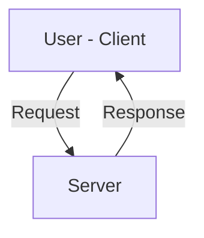
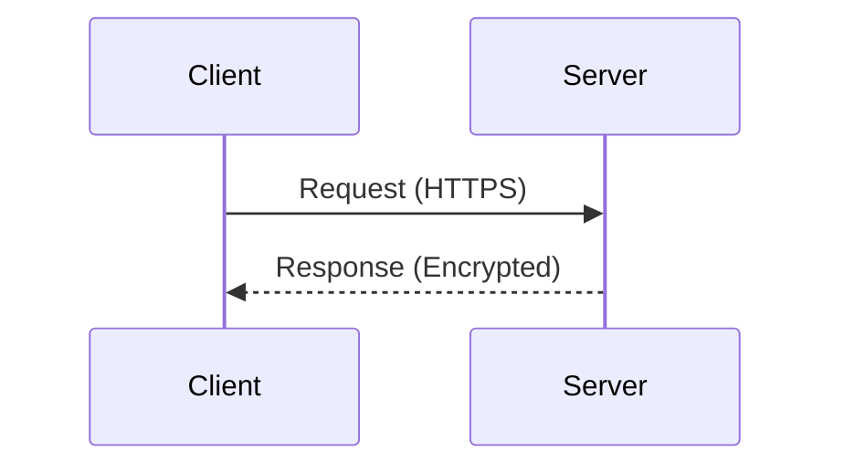

The Internet operates on a simple yet powerful concept: **clients and servers**. Every time you browse a website, watch a video, or send an email, your device (the *client*) communicates with another system (the *server*) that provides the requested data or service.

## The Core Idea

Think of the Internet as a giant conversation. Your computer, phone, or browser **asks questions** and servers **reply with answers**.

In this model:
* The **client** initiates communication.
* The **server** listens, processes, and responds.

## What Is a Client?

A **client** is any device or software that requests resources or services from a server.

Common examples:
* Web browsers (like Chrome, Firefox, Edge)
* Mobile apps
* Command-line tools (like `curl` or `wget`)

Clients don’t store the data permanently, they only display or use it temporarily.



## What Is a Server?

A **server** is a system (computer or application) that **stores**, **manages**, and **serves** data to clients over a network. It runs specialized software like:
* **Web servers** (e.g., Apache, Nginx)
* **Database servers** (e.g., MySQL, MongoDB)
* **Mail servers** (e.g., Postfix)

Servers are designed for **reliability** and **availability**, often running 24/7 in data centers.

## How Clients and Servers Communicate

Communication follows a **request-response model**, using **protocols** such as HTTP or HTTPS.

1. The client sends a **request** to a server.
2. The server **processes** the request.
3. The server sends a **response** (like an HTML page or JSON data).

Here’s a simplified example:

```http
GET /home HTTP/1.1
Host: codeharborhub.github.io
```

The server replies:

```http
HTTP/1.1 200 OK
Content-Type: text/html

<html>
  <body>Welcome to CodeHarborHub!</body>
</html>
```

## Real-World Example

When you visit **https://codeharborhub.github.io**:
* Your browser (the client) sends a request.
* GitHub Pages (the server) finds and returns the website files.
* The browser displays them on your screen.

You never directly see the server, but every webpage you view comes from one.

## Types of Client–Server Architecture

| Type | Description | Example |
|------|--------------|----------|
| **1-Tier** | Client and server on the same machine | Local software like MS Word |
| **2-Tier** | Direct client-server communication | Web browser ↔ Web server |
| **3-Tier** | Includes a database layer | Browser ↔ App server ↔ Database |
| **N-Tier** | Distributed services and APIs | Modern cloud-based systems |

## Security & HTTPS

When data travels between client and server, security is essential. With **HTTPS**, information is encrypted using **SSL/TLS**, preventing eavesdropping and tampering.



## Key Takeaways

* **Clients** request data or services.  
* **Servers** store and deliver that data.  
* They communicate through **standard protocols** (HTTP, HTTPS, FTP, etc.).  
* The **request–response model** is at the heart of how the Internet works.  
* Modern systems often involve **multiple servers and APIs** behind the scenes.


> “Every click, every page, every message you send, is just one client talking to one server somewhere in the world.”