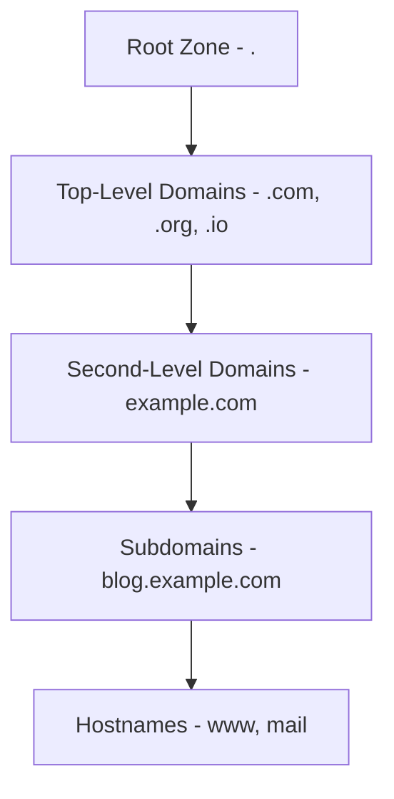
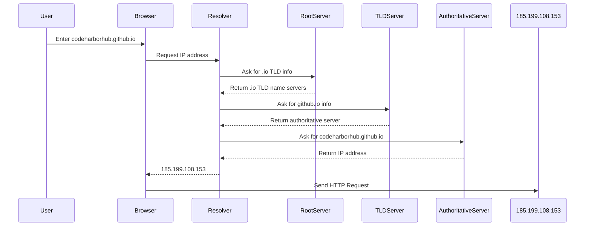

The **Domain Name System (DNS)** is one of the most essential — yet often overlooked components of the Internet. It’s what allows us to use memorable names like `codeharborhub.github.io` instead of complex numerical IP addresses.

DNS acts as the **Internet’s phonebook**, translating **domain names** into **IP addresses** so browsers can locate and communicate with servers worldwide.

## Why DNS Exists

Computers communicate using numbers (IP addresses), not words. Before DNS, users had to manually look up and remember numeric addresses — an unscalable and error-prone process.

DNS was created to solve this by introducing a **distributed, hierarchical naming system** that’s:
* **Human-friendly**: You type names, not numbers.
* **Scalable**: Works across billions of domains.
* **Automatic**: Queries happen invisibly in milliseconds.

## DNS Hierarchy Overview

The DNS system is hierarchical, like a tree:



Each level plays a specific role in locating resources on the Internet.

## How a DNS Query Works (Step-by-Step)

When you enter a URL such as **https://codeharborhub.github.io**, your browser performs several steps to find its IP address:



All this happens in a fraction of a second.

## The Four Key DNS Server Types

| Server Type | Description |
|--------------|--------------|
| **DNS Resolver (Recursive Resolver)** | Usually provided by your ISP or a public DNS service (like Google `8.8.8.8`). It initiates and manages DNS lookups on your behalf. |
| **Root Name Server** | The top-level of DNS — knows where to find TLD servers (like `.com`, `.io`, `.net`). |
| **TLD Name Server** | Stores information about domains under a specific top-level domain. |
| **Authoritative Name Server** | The final authority — provides the actual IP address for a domain. |

## Common DNS Record Types

DNS uses **resource records (RRs)** to store information. Each type serves a specific purpose:

| Record Type | Description | Example |
|--------------|--------------|----------|
| **A** | Maps a domain to an IPv4 address. | `codeharborhub.github.io → 185.199.108.153` |
| **AAAA** | Maps a domain to an IPv6 address. | `example.com → 2606:2800:220:1:248:1893:25c8:1946` |
| **CNAME** | Alias for another domain name. | `www.example.com → example.com` |
| **MX** | Mail server record (used for email routing). | `example.com → mail.example.com` |
| **TXT** | Stores arbitrary text info (SPF, DKIM, verification). | `v=spf1 include:_spf.google.com ~all` |
| **NS** | Identifies the authoritative name servers for a domain. | `example.com → ns1.example.net` |

## DNS Caching — Speed Optimization

To reduce lookup time and network load, DNS results are **cached** at multiple levels:
* **Browser Cache** – Short-term memory for recently visited domains.
* **Operating System Cache** – Local DNS records stored temporarily.
* **Resolver Cache** – Managed by ISPs or public DNS resolvers.

Each record has a **TTL (Time To Live)** that defines how long it stays valid before a recheck.

## Practical Example — DNS Lookup Flow

<Tabs>
  <TabItem value="nontechnical" label="Simple View" default>
    You type `codeharborhub.github.io` → DNS finds its IP → Browser connects → Website loads.  
    It’s that simple — all automatic.
  </TabItem>
  <TabItem value="technical" label="Technical Flow">
    1. The browser checks its cache.  
    2. If not found, it asks the **local resolver**.  
    3. The resolver queries **root**, **TLD**, and **authoritative** servers.  
    4. The IP is returned and cached.  
    5. The browser sends the HTTP request to that IP.  
  </TabItem>
</Tabs>

## DNS in Action — Simulation

```jsx live
function DnsDemo() {
  const [resolved, setResolved] = React.useState(false);
  const resolve = () => setResolved(true);

  return (
    <div style={{ textAlign: "center" }}>
      <h3>DNS Resolution Simulation</h3>
      <p>Domain: codeharborhub.github.io</p>
      <button onClick={resolve}>Resolve Domain</button>
      {resolved && <p> IP Address: 185.199.108.153</p>}
    </div>
  );
}
```

## Security in DNS

DNS was designed for speed and reliability — not security. Attackers exploit this through methods like:

* **DNS Spoofing / Cache Poisoning:** Injecting false IP mappings.  
* **DNS Hijacking:** Redirecting users to malicious servers.  
* **Amplification Attacks:** Overloading DNS servers to cause downtime.

To counter these, **DNSSEC (Domain Name System Security Extensions)** was introduced. It digitally signs DNS data, ensuring authenticity and integrity.

## Key Takeaways

* DNS is the **Internet’s distributed naming system** that maps domain names to IP addresses.  
* The DNS hierarchy consists of **Root**, **TLD**, and **Authoritative** servers.  
* DNS uses various **record types** (A, AAAA, CNAME, MX, TXT) to manage different data.  
* **Caching** makes DNS fast, while **DNSSEC** makes it secure.  
* Every click, website, or API request starts with a DNS lookup — it’s the silent foundation of the web.

:::tip
Learn about [IP Addressing](./ip-addresses.mdx) — the numerical system that identifies every device on the Internet.
:::