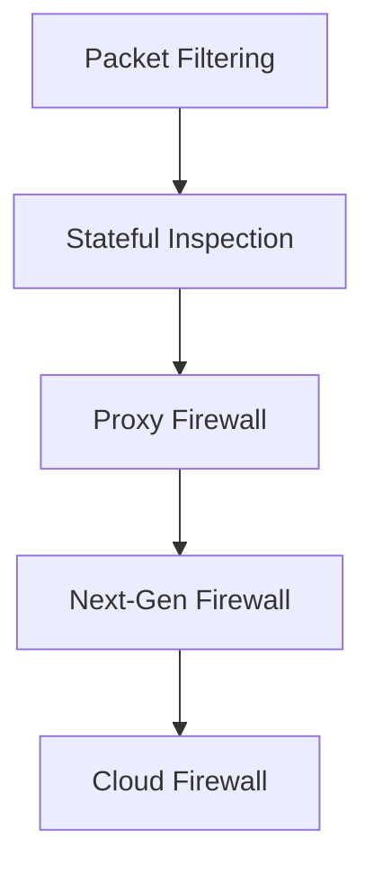

The Internet is a powerful and open system but that openness also creates risks. To keep networks secure, we rely on **firewalls**, the first line of defense against unwanted traffic, hackers, and cyberattacks.

## What Is a Firewall?

A **firewall** is a **security barrier** that monitors and controls incoming and outgoing network traffic based on a set of rules. It acts as a **filter between trusted and untrusted networks**, such as between your computer and the Internet.

:::info
Think of a firewall as a security guard at the entrance of a building, checking IDs and only allowing authorized personnel to enter.

In simple terms, firewalls help ensure that only safe and approved data can pass through to your network.
:::


## How Firewalls Work

Firewalls inspect **data packets** as they travel across networks. Each packet is analyzed against **security rules**, such as:

* Source and destination IP addresses  
* Port numbers  
* Protocols (HTTP, HTTPS, FTP, etc.)  
* Packet contents (in advanced firewalls)

<Tabs>
  <TabItem value="basic" label="Basic View" default>
    A basic firewall might allow web traffic (port 80/443) but block suspicious connections or file transfers on other ports.
  </TabItem>
  <TabItem value="technical" label="Technical View">
    1. Packet enters the firewall.  
    2. Firewall checks **header information** (source, destination, port).  
    3. Rules are applied — e.g., “block all incoming SSH except from admin IPs.”  
    4. Packet is either **allowed**, **blocked**, or **logged** for review.
  </TabItem>
</Tabs>

## Example: Simple Firewall Simulation

```jsx live
function FirewallSimulator() {
  const handleRequest = (type) => {
    if (type === "http") alert("Allowed: Web traffic (Port 443)");
    else alert("Blocked: Unauthorized traffic (Port 23)");
  };
  return (
    <div style={{ textAlign: "center" }}>
      <h3>Firewall Traffic Filter</h3>
      <button onClick={() => handleRequest("http")}>Send HTTPS Request</button>
      <button onClick={() => handleRequest("telnet")}>Send Telnet Request</button>
    </div>
  );
}
```

## Types of Firewalls

Firewalls can operate at different layers of the network stack and offer varying levels of security:

| Type | Layer | Description |
|------|--------|-------------|
| **Packet-Filtering Firewall** | Network | Checks basic info like IPs and ports; fast but limited. |
| **Stateful Inspection Firewall** | Transport | Tracks active connections and allows related packets. |
| **Proxy Firewall** | Application | Intercepts and inspects data at the application layer (HTTP, FTP). |
| **Next-Generation Firewall (NGFW)** | Multiple | Includes intrusion detection, malware filtering, and deep inspection. |
| **Cloud Firewall (FWaaS)** | Cloud | Firewall-as-a-Service — protects cloud apps and virtual networks. |



## Firewall Rules Example

| Rule | Action | Description |
|------|---------|-------------|
| Allow TCP port 443 | Allow | Enable secure web browsing (HTTPS). |
| Block TCP port 23 | Block | Disable Telnet — an insecure protocol. |
| Allow ICMP from internal network | Allow | Permit internal ping requests. |
| Block all inbound traffic by default | Block | Enforce a default-deny security posture. |

```bash
# Example Linux UFW firewall commands
sudo ufw default deny incoming
sudo ufw allow 443/tcp
sudo ufw deny 23/tcp
sudo ufw enable
```

## Network Placement of Firewalls

Firewalls can exist in multiple forms hardware, software, or cloud-based — and are typically placed between the **LAN** and **Internet**. In a typical home or office setup:


Some organizations use multiple layers of firewalls **perimeter firewalls** at the network edge and **internal firewalls** between departments or services.

## Stateful vs Stateless Firewalls

| Feature | Stateless Firewall | Stateful Firewall |
|----------|-------------------|-------------------|
| Tracks connections | No | Yes |
| Security level | Basic | High |
| Performance | Fast | Slightly slower |
| Use case | Simple traffic filtering | Complex enterprise networks |

:::note
Stateful firewalls are generally preferred for modern networks due to their ability to monitor ongoing connections and provide enhanced security.
:::

## Firewall Limitations

While firewalls are powerful, they aren’t a complete solution on their own.

* Cannot detect **internal threats** or **phishing attacks**.  
* May slow down traffic if poorly configured.  
* Need **regular updates** to remain effective.  
* Must be combined with antivirus, intrusion detection, and monitoring tools.

## Real-World Examples of Firewalls

| Vendor | Product | Highlights |
|--------|----------|------------|
| **Cisco ASA** | Enterprise Firewall | Hardware-based security with advanced inspection. |
| **Fortinet FortiGate** | Unified Threat Management | Combines firewall, VPN, and intrusion prevention. |
| **Palo Alto Networks NGFW** | Next-Gen Firewall | Application-level inspection with ML-driven threat detection. |
| **Cloudflare WAF** | Cloud Firewall | Protects websites from online attacks at the edge. |

## Key Takeaways

* A **firewall** is a traffic filter that protects your system from unauthorized access.  
* It uses predefined **rules** to allow or block network traffic.  
* Modern **Next-Gen Firewalls** combine inspection, intrusion prevention, and threat intelligence.  
* Firewalls are essential for **network security**, but should be part of a **multi-layered defense strategy**.