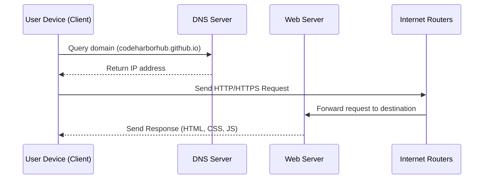
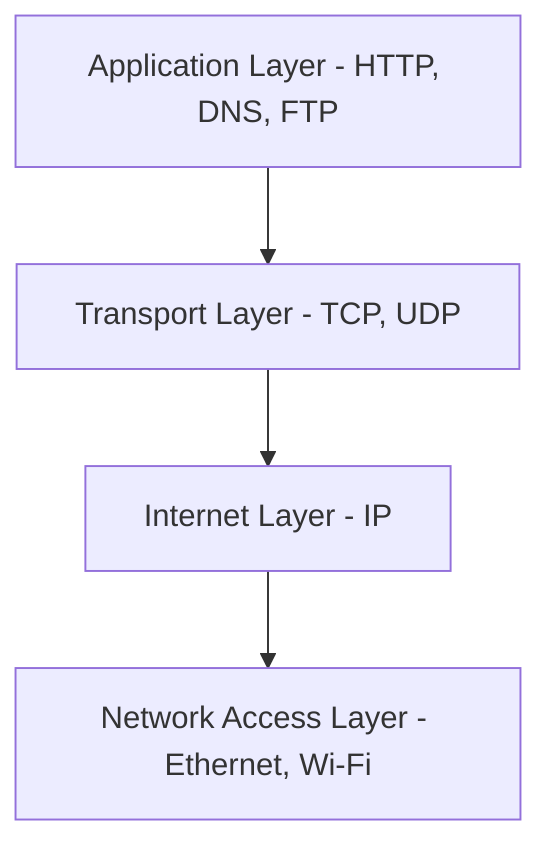
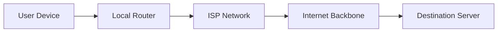

The Internet may seem like magic — you type a URL, and a webpage instantly appears. But behind that simplicity lies an incredibly complex system of **data transmission, routing, and communication protocols** that make it all possible.

## The Journey of a Web Request

When you visit a website like `https://codeharborhub.github.io`, your browser follows a precise set of steps to fetch the data.



<br />

Let’s break down what happens in this process

## Step-by-Step: How It Works

1. **DNS Resolution:** When you enter a domain name, your device first asks a **DNS server** to translate it into an IP address (like `142.250.190.78`). DNS works like the **phonebook of the Internet**, mapping human-readable names to machine-readable numbers.

2. **Establishing a Connection:** Once the IP is known, your browser connects to the destination server using the **TCP/IP protocol** — the backbone of Internet communication.

3. **Request and Response:** The browser sends an **HTTP request** asking for a webpage. The server processes the request and replies with an **HTTP response**, which contains HTML, CSS, and JavaScript files.

4. **Rendering the Page:** The browser interprets these files, builds the page structure (DOM), applies styles, executes JavaScript, and displays the final page you see.

## Visualizing the Process

<Tabs>
  <TabItem value="conceptual" label="Conceptual View" default>
    You can think of the Internet like a **postal system**:  
    * Your message (data) is packed into **envelopes** (packets).  
    * The **address** (IP) tells routers where to deliver it.  
    * Routers act like **post offices**, ensuring it reaches the right destination.  
    * The server opens it, prepares a reply, and sends it back the same way.
  </TabItem>

  <TabItem value="technical" label="Technical View">
    In technical terms:  
    * Data is **split into packets** (small chunks).  
    * Each packet includes a **header** (source, destination, sequence info).  
    * Packets may take **different routes** through routers and switches.  
    * Once all packets arrive, the system **reassembles** them in the correct order.
  </TabItem>
</Tabs>

## Data Transmission in Action

```jsx live
function PacketFlow() {
  const [stage, setStage] = React.useState(0);
  const steps = [
    "Sending DNS request...",
    "Connecting via TCP/IP...",
    "Sending HTTP request...",
    "Routing through Internet nodes...",
    "Receiving response: 200 OK",
  ];
  return (
    <div style={{ textAlign: "center" }}>
      <h3>Internet Packet Simulation</h3>
      <p>{steps[stage]}</p>
      <button
        onClick={() => setStage((s) => (s + 1) % steps.length)}
        style={{
          marginTop: "10px",
          padding: "8px 16px",
          borderRadius: "8px",
          background: "#007acc",
          color: "white",
          border: "none",
          cursor: "pointer",
        }}
      >
        Next Step
      </button>
    </div>
  );
}
```

Click through the stages to simulate a real-world data flow

## The Role of Protocols

The Internet relies on **protocols** — sets of rules that define how data is sent and received.  
Here are some of the most important ones:

| Protocol | Full Form | Purpose |
|-----------|------------|----------|
| **HTTP / HTTPS** | HyperText Transfer Protocol (Secure) | Transfers web content between browsers and servers. |
| **TCP / UDP** | Transmission Control / User Datagram Protocol | Controls data delivery — TCP ensures reliability, UDP prioritizes speed. |
| **IP** | Internet Protocol | Defines addressing and routing rules for data packets. |
| **DNS** | Domain Name System | Resolves domain names to IP addresses. |
| **FTP / SFTP** | File Transfer Protocol | Transfers files between systems securely. |

## The TCP/IP Model in Practice



Each layer has a defined responsibility:

* **Application Layer:** User-facing protocols (HTTP, DNS, FTP).  
* **Transport Layer:** Handles packet reliability and sequencing.  
* **Internet Layer:** Manages IP addressing and routing.  
* **Network Access Layer:** Defines how devices physically connect (cables, Wi-Fi, fiber).

## How Data Finds Its Path

When a packet leaves your computer, it doesn’t travel in a straight line.  
It hops through **multiple routers**, sometimes across countries or continents.



Each router reads the packet header, checks its destination, and forwards it closer to the target.

## Common Misconceptions

:::warning
The Internet is not a single entity or controlled by one organization. It’s a **decentralized network** maintained by thousands of independent systems working together.
:::

:::tip
Every time you click a link or send a message, your data travels through **multiple networks**, often across countries, before reaching its destination.
:::

## Key Takeaways

* The Internet transmits data through **packets** using **TCP/IP** protocols.  
* **DNS** resolves domain names into IP addresses.  
* **Routers** and **switches** direct data across multiple networks.  
* Protocols like **HTTP**, **HTTPS**, and **FTP** define communication rules.  
* The Internet is decentralized, fast, and fault-tolerant — designed to keep working even when parts fail.