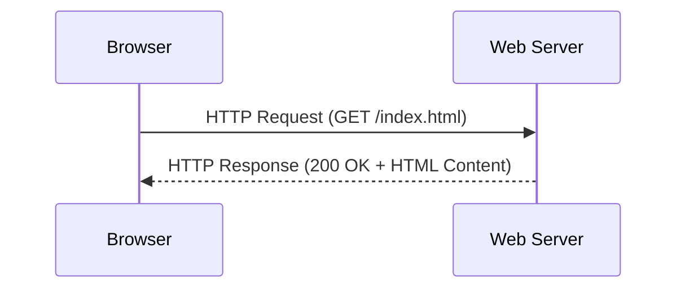
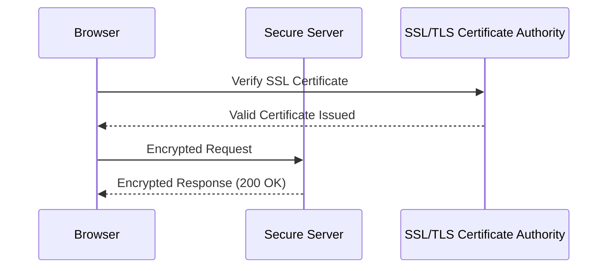
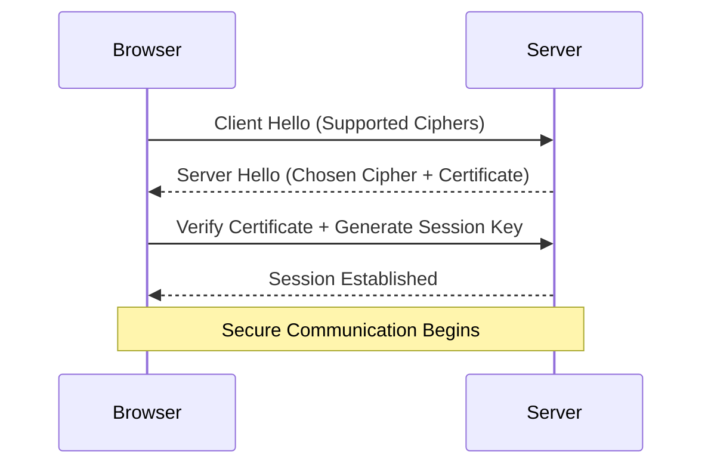

When you browse the Internet, you’ve probably noticed some websites start with **http://** and others with **https://**. That single letter **‘S’** makes a world of difference — it stands for **Secure**.

In this lesson, you’ll learn what HTTP and HTTPS mean, how they work, and why modern websites must use HTTPS for both **security** and **trust**.

## What Is HTTP?

**HTTP (Hypertext Transfer Protocol)** is the foundation of data communication on the web.  
It defines how a client (like your browser) and a server exchange information.

When you type a URL like `http://example.com`, your browser sends an **HTTP request** to the server, which responds with an **HTTP response** containing the website content.



This is how every web page loads — request, response, and render.

## The Problem with HTTP

HTTP sends data **in plain text**, meaning anyone who intercepts it (like hackers on public Wi-Fi) can read it.  

This exposes sensitive information such as:
* Login credentials  
* Personal details  
* Payment data  

Without encryption, your data can be **stolen or altered** mid-transfer.

## Enter HTTPS — The Secure Protocol

**HTTPS (Hypertext Transfer Protocol Secure)** is the **secure** version of HTTP. It uses **SSL/TLS (Secure Sockets Layer / Transport Layer Security)** to encrypt the data before sending it across the Internet.



This ensures:
* Data is **encrypted** (cannot be read by others)  
* The website is **authenticated** (you’re connected to the right server)  
* Data integrity is **preserved** (no tampering during transit)

## How HTTPS Works — Step by Step

<Tabs>
  <TabItem value="simple" label="Simple View" default>
    1. Browser connects to a website using HTTPS.  
    2. The website sends its **SSL certificate** for verification.  
    3. The browser checks if it’s valid and trusted.  
    4. Once verified, an **encrypted connection** is established.  
    5. Secure data exchange begins.
  </TabItem>

  <TabItem value="technical" label="Technical Flow">
    * HTTPS uses **port 443** (HTTP uses port 80).  
    * The browser and server perform an **SSL/TLS handshake**.  
    * A **session key** is generated for encryption.  
    * Data is exchanged using **symmetric encryption** for speed.  
    * Certificates are validated via **Certificate Authorities (CAs)**.  
  </TabItem>
</Tabs>

## SSL/TLS Handshake (Simplified)



This process happens every time you visit a secure website — often in milliseconds.

## Comparing HTTP vs HTTPS

| Feature | **HTTP** | **HTTPS** |
|----------|-----------|------------|
| **Port** | 80 | 443 |
| **Encryption** | No | Yes (SSL/TLS) |
| **Security** | Vulnerable to eavesdropping | Secure and encrypted |
| **Speed** | Slightly faster (no encryption) | Modern HTTPS is optimized (HTTP/2, QUIC) |
| **SEO Ranking** | No boost | Google ranks HTTPS sites higher |
| **Trust Indicator** | No padlock | Padlock shown in browser |
| **Data Integrity** | Can be modified | Protected from tampering |


## Demo: Simulating HTTP vs HTTPS

```jsx live
function HttpVsHttpsDemo() {
  const [secure, setSecure] = React.useState(false);

  return (
    <div style={{ textAlign: "center" }}>
      <h3>{secure ? "HTTPS Secure Mode" : "HTTP Insecure Mode"}</h3>
      <p>
        {secure
          ? "🔒 Encrypted connection established. Your data is safe!"
          : "⚠️ Data sent in plain text. Anyone can read it!"}
      </p>
      <button onClick={() => setSecure(!secure)}>
        {secure ? "Switch to HTTP" : "Switch to HTTPS"}
      </button>
    </div>
  );
}
```

## Browser Indicators

Modern browsers clearly show whether a site is secure:
* **Padlock icon** = HTTPS (secure)
* **Warning or Not Secure** = HTTP (unsafe)
* **Red alert or blocked** = Invalid certificate

## Why HTTPS Matters

* **Protects users** from data theft and manipulation.  
* **Builds trust** with visitors — especially for login or payment pages.  
* **Improves SEO ranking** — Google penalizes non-HTTPS sites.  
* **Enables modern APIs** like geolocation, service workers, and PWA features (they require secure origins).

## How to Enable HTTPS on Your Website

1. Get a valid **SSL/TLS certificate**  
   * Use free options like [Let’s Encrypt](https://letsencrypt.org/)  
2. Configure your **web server**  
   * Apache: enable `mod_ssl`  
   * Nginx: use `ssl_certificate` directives  
3. Redirect all HTTP traffic to HTTPS (`301 Redirect`)  
4. Test your configuration on [SSL Labs](https://www.ssllabs.com/ssltest/)

## Quick Math — Encryption Strength (KaTeX)

Encryption complexity increases exponentially with key length:

$$
Security \propto 2^n
$$

Where `n` = key size (in bits).  
So a 256-bit AES encryption has $2^{256}$ possible combinations — practically unbreakable.

## Key Takeaways

* **HTTP** is fast but insecure; **HTTPS** is encrypted and trusted.  
* HTTPS relies on **SSL/TLS certificates** to secure data transfer.  
* Modern browsers, APIs, and SEO favor HTTPS-only sites.  
* Implementing HTTPS is now **essential**, not optional.
