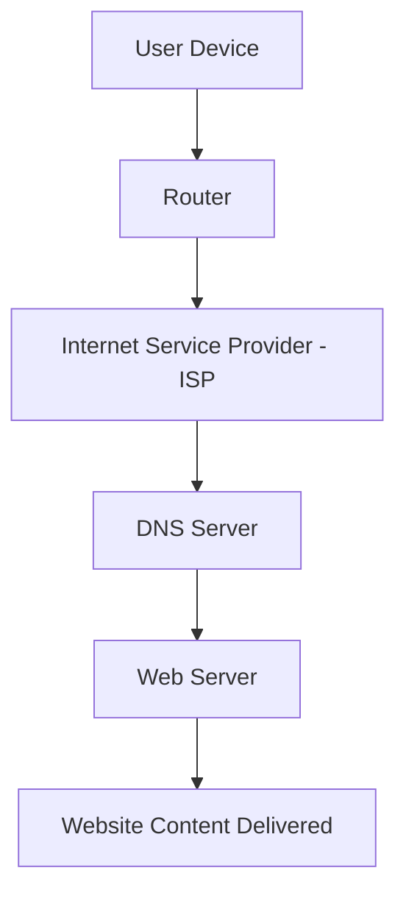

The **Internet** is the invisible web of connections that powers almost everything we do — from loading a webpage to sending a message across the globe. It’s not a single machine or network but a massive system of **interconnected computers** communicating through agreed-upon rules called **protocols**.

## What Is the Internet?

At its core, the Internet is a **network of networks**. Every device connected to it — whether it’s your phone, a data center, or a satellite — follows these same protocols to exchange information.

:::info
Many people confuse the **Internet** with the **World Wide Web (WWW)**. The Internet is the **infrastructure** (the cables, routers, and data pathways), while the Web is a **service** built on top of it — using browsers and HTTP to access websites.
:::



This diagram shows the typical journey of a web request. When you open a site, your device connects through your **router**, passes through your **ISP**, queries a **DNS server** to find the site’s location, and finally reaches the **web server** that sends the page back.

## How the Internet Works

<Tabs>
  <TabItem value="simple" label="Simple View" default>
    When you type a URL like **https://codeharborhub.github.io**, your browser first asks a **DNS server** to find the matching IP address.  
    It then connects to that address using **HTTP or HTTPS**, downloads the data, and displays it as a webpage.
  </TabItem>

  <TabItem value="technical" label="Technical View">
    1. The browser sends an **HTTP request** to the server.  
    2. The request is split into packets and routed through various networks using **TCP/IP**.  
    3. The server responds with an **HTTP response**, usually containing HTML, CSS, or JS files.  
    4. **HTTPS** adds a layer of encryption, ensuring data privacy during transmission.
  </TabItem>
</Tabs>

## A Simple HTTP Request in Action

```jsx live
function InternetExample() {
  return (
    <div style={{ textAlign: "center" }}>
      <h3>Browser Request Simulation</h3>
      <p>Client → DNS → Server → Response</p>
      <button onClick={() => alert("Response: 200 OK")}>Send Request</button>
    </div>
  );
}
```

When you click the button, imagine your browser requesting data from a remote server — and getting a **“200 OK”** response if everything works correctly.

## Core Components of the Internet

| Component  | Role |
| ----------- | ---- |
| **Client** | The end-user device (like a browser or mobile app) that requests data. |
| **Server** | The machine that processes requests and sends back responses. |
| **DNS** | Converts domain names (like `codeharborhub.github.io`) into IP addresses that computers understand. |
| **ISP** | Connects users to the global Internet infrastructure. |
| **Router** | Directs data packets between networks, ensuring they reach the right destination. |

## Understanding Data Transfer

The rate of data transfer (speed) can be described mathematically:

$$
Speed = \frac{Data\ Size}{Time}
$$

For example, downloading a **10 MB** file in **5 seconds** means:

$$
Speed = \frac{10}{5} = 2\ \text{MB/s}
$$

While this looks simple, real-world speeds depend on factors like bandwidth, latency, and network congestion.

## The TCP/IP Model

The Internet runs on a layered system known as the **TCP/IP model**, which defines how data moves from one point to another.


Each layer has a specific job:

* **Application Layer:** Handles data for applications (HTTP, DNS, FTP).  
* **Transport Layer:** Ensures reliable delivery (TCP, UDP).  
* **Internet Layer:** Routes packets using IP addresses.  
* **Network Access Layer:** Manages physical connections (Ethernet, Wi-Fi).

## Key Takeaways

* The Internet is a **global system** that connects billions of devices.  
* Communication happens through **clients**, **servers**, and **routers** using standard protocols.  
* **DNS** resolves domain names, and **TCP/IP** ensures reliable data transfer.  
* Security protocols like **HTTPS** protect your information online.