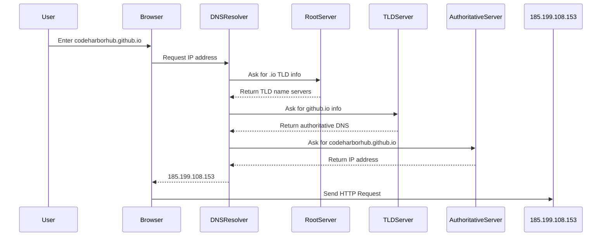

When you visit a website like **codeharborhub.github.io**, your browser doesn’t actually understand the name, it only understands **numbers**. These numbers are called **IP addresses**, and the system that translates human-friendly names into them is called the **Domain Name System (DNS)**.

## What Is an IP Address?

An **IP (Internet Protocol) address** is a unique identifier assigned to every device connected to the Internet. It’s like a *postal address* for computers, it tells other systems **where** to send or receive data.

### Two Common Versions:

| Version | Format | Example | Usage |
|----------|---------|----------|--------|
| **IPv4** | 32-bit (4 numbers separated by dots) | `192.168.1.1` | Most widely used, limited supply |
| **IPv6** | 128-bit (hexadecimal separated by colons) | `2400:cb00:2048:1::c629:d7a2` | Modern, supports billions of devices |

## What Is DNS?

The **Domain Name System (DNS)** is often described as the *phonebook of the Internet*. It translates easy-to-remember domain names (like `google.com`) into machine-readable IP addresses (like `142.250.190.78`).

Without DNS, you’d have to memorize long strings of numbers just to visit your favorite websites.

## How DNS Works — Step by Step

Let’s walk through what happens when you type **https://codeharborhub.github.io** into your browser:



<br />

Each lookup happens in milliseconds — that’s the magic of the Internet’s infrastructure.

## DNS Components Explained

| Component | Description |
|------------|--------------|
| **DNS Resolver** | The first point of contact — usually operated by your ISP or a public service (like Google DNS `8.8.8.8`). |
| **Root Servers** | The highest level in DNS — directs the query to the correct top-level domain (like `.com`, `.org`, `.io`). |
| **TLD Servers** | Handle requests for specific top-level domains. |
| **Authoritative Name Servers** | Contain the final IP record for the domain. |

## Types of DNS Records

| Record Type | Purpose | Example |
|--------------|----------|----------|
| **A** | Maps a domain to an IPv4 address | `example.com → 93.184.216.34` |
| **AAAA** | Maps a domain to an IPv6 address | `example.com → 2606:2800:220:1:248:1893:25c8:1946` |
| **CNAME** | Alias to another domain | `www.example.com → example.com` |
| **MX** | Mail server record | `example.com → mail.example.com` |
| **TXT** | Stores text info (often for verification) | `v=spf1 include:_spf.google.com ~all` |

## Real-World Analogy

Think of **DNS** like asking for directions:
* You know the **name** of a restaurant (domain name).
* You ask a **directory service** (DNS) for its address.
* You drive to that **location** (IP address).

Without DNS, you’d have to remember every single street address (IP) manually.

## Fun Fact

The first DNS system was invented in **1983** by **Paul Mockapetris**, replacing a single centralized text file (`hosts.txt`) that originally stored all Internet addresses!

## DNS and Security

Since DNS is critical to Internet functionality, it’s also a target for attacks like:
* **DNS Spoofing (Cache Poisoning):** Fake responses redirect users to malicious sites.
* **DNS Hijacking:** Attackers modify DNS settings to steal traffic.

To mitigate this, technologies like **DNSSEC (Domain Name System Security Extensions)** ensure authenticity and integrity of DNS responses.

## Quick Demo

```jsx live
function DnsLookupDemo() {
  const [ip, setIp] = React.useState("");
  const lookup = () => setIp("185.199.108.153");
  return (
    <div style={{ textAlign: "center" }}>
      <h3>DNS Lookup Simulation</h3>
      <p>Domain: codeharborhub.github.io</p>
      <button onClick={lookup}>Resolve Domain</button>
      {ip && <p> IP Address: {ip}</p>}
    </div>
  );
}
```

## Key Takeaways

* **IP addresses** identify devices; **DNS** translates names to addresses.  
* The DNS process involves **resolvers**, **root servers**, **TLD servers**, and **authoritative servers**.  
* Common record types: **A**, **AAAA**, **CNAME**, **MX**, **TXT**.  
* **DNSSEC** helps secure DNS lookups from tampering.  
* Every website you visit goes through a DNS lookup first — it’s the Internet’s invisible phonebook.

> “Every website starts with a name, but it’s DNS that tells your browser where that name truly lives.”