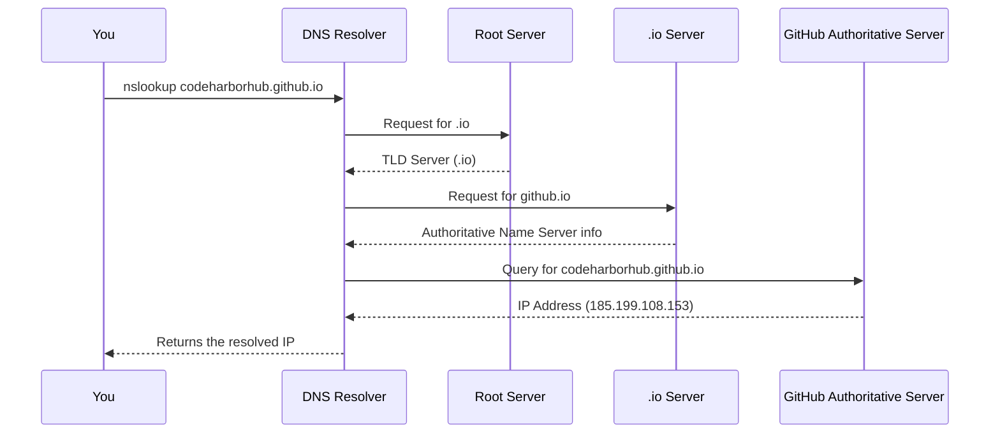

The **`nslookup`** (Name Server Lookup) command is one of the most essential tools for network diagnostics. It allows you to **query DNS servers** to find the IP address of a domain or verify other DNS records like MX, TXT, or CNAME.

:::info
Think of `nslookup` as a phone book for the Internet — it helps you find the phone number (IP address) associated with a person’s name (domain).
:::

## What Is nslookup?

`nslookup` stands for **Name Server Lookup**. It’s a command-line tool available on Windows, macOS, and Linux that helps you:

* Check if a **domain name** resolves correctly to an IP address.  
* View **DNS records** for troubleshooting.  
* Identify **name server (NS)** or **mail server (MX)** configurations.  
* Diagnose **DNS-related issues** such as incorrect resolution or timeouts.

## Basic Syntax

```bash
nslookup [options] [domain] [dns-server]
```

| Parameter | Description |
| ---------- | ------------ |
| `domain` | The domain name you want to query (e.g., `codeharborhub.github.io`) |
| `dns-server` | (Optional) The specific DNS server you want to use |
| `options` | Flags or arguments to modify the behavior |

Example:

```bash
nslookup codeharborhub.github.io
```

Output:

```bash
Server:  dns.google
Address:  8.8.8.8

Non-authoritative answer:
Name:    codeharborhub.github.io
Address: 185.199.108.153
```

## How nslookup Works

When you run `nslookup`, it sends a **query** to a **DNS resolver**. The resolver checks its cache or contacts **authoritative name servers** to find the answer.



## Common Use Cases

| Purpose | Command | Description |
| -------- | -------- | ------------ |
| Basic IP lookup | `nslookup google.com` | Returns the IP address for the domain |
| Use a specific DNS server | `nslookup codeharborhub.github.io 8.8.8.8` | Queries Google DNS (8.8.8.8) |
| Check MX records | `nslookup -type=mx gmail.com` | Lists mail servers for Gmail |
| View Name Servers | `nslookup -type=ns github.com` | Shows authoritative DNS servers |
| View TXT records | `nslookup -type=txt openai.com` | Displays domain verification or SPF records |
| Reverse lookup | `nslookup 8.8.8.8` | Finds the domain name associated with an IP |

## Interactive Example

```jsx live
function NslookupDemo() {
  const [domain, setDomain] = React.useState("codeharborhub.github.io");
  const [response, setResponse] = React.useState("");

  const handleLookup = () => {
    setResponse(`Non-authoritative answer:
Name: ${domain}
Address: 185.199.108.153`);
  };

  return (
    <div style={{ textAlign: "center" }}>
      <h3>Simulate nslookup Command</h3>
      <input
        type="text"
        value={domain}
        onChange={(e) => setDomain(e.target.value)}
        style={{ padding: "8px", width: "60%", borderRadius: "8px" }}
      />
      <br />
      <button
        style={{
          marginTop: "10px",
          padding: "8px 16px",
          borderRadius: "6px",
          cursor: "pointer",
        }}
        onClick={handleLookup}
      >
        Run Lookup
      </button>
      <pre style={{ marginTop: "15px", textAlign: "left" }}>{response}</pre>
    </div>
  );
}
```

In this simulation, you can enter any domain name and click "Run Lookup" to see a mock response similar to what `nslookup` would return.

## Types of DNS Records You Can Query

| Record Type | Description | Example |
| ------------ | ------------ | -------- |
| `A` | Maps a domain name to an IPv4 address | `185.199.108.153` |
| `AAAA` | Maps a domain to an IPv6 address | `2606:50c0:8001::153` |
| `MX` | Identifies mail servers for the domain | `aspmx.l.google.com` |
| `NS` | Lists authoritative name servers | `ns1.github.io` |
| `CNAME` | Provides alias names | `www → codeharborhub.github.io` |
| `TXT` | Stores verification or SPF info | `"v=spf1 include:_spf.google.com"` |

## Common Issues and Errors

| Error | Meaning |
| ------ | -------- |
| `*** Can't find server name` | DNS resolver not configured properly |
| `Non-existent domain` | The queried domain does not exist |
| `Request timed out` | DNS server not responding |
| `NXDOMAIN` | The domain name can’t be resolved |

## Example: Query Timing

If a DNS query takes 50 ms to respond and you perform 4 lookups:

$$
Average\ Query\ Time = \frac{50 + 48 + 52 + 50}{4} = 50\text{ ms}
$$

That means your DNS response time averages around **50 milliseconds**, which is quite fast.

:::note
Keep in mind that DNS caching can affect response times. Subsequent queries for the same domain may return faster results due to cached data.
:::

## Quick Commands Reference

```bash
# Basic domain lookup
nslookup codeharborhub.github.io

# Query using Cloudflare DNS
nslookup codeharborhub.github.io 1.1.1.1

# Check mail records
nslookup -type=mx example.com

# Find authoritative name servers
nslookup -type=ns example.com
```

## Key Takeaways

* **`nslookup`** queries DNS servers to fetch IPs and record details.  
* It’s useful for **troubleshooting**, **validation**, and **network diagnostics**.  
* Works across platforms (Windows, macOS, Linux).  
* Helps identify **DNS misconfigurations, delays, or missing records**.
* Understanding DNS records (A, MX, NS, CNAME, TXT) is crucial for effective use of `nslookup`.