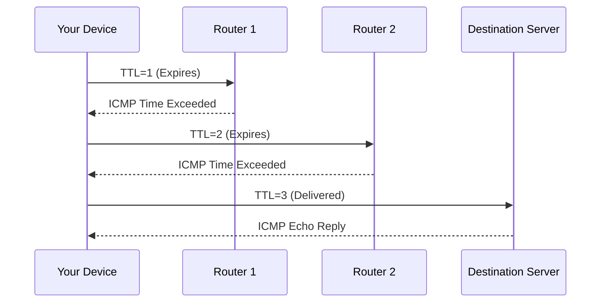

When your Internet feels slow or a website won’t load, tools like **Ping** and **Traceroute** help you understand what’s happening behind the scenes. They are essential network utilities used by developers, system admins, and engineers to **diagnose connectivity problems** and **analyze network performance**.

## What Are Ping and Traceroute?

Both tools check **how data travels** between your device (client) and another server (host), but they do it in different ways.

| Tool | Purpose | Protocol Used |
| ---- | -------- | -------------- |
| **Ping** | Tests connectivity and measures response time (latency). | ICMP (Internet Control Message Protocol) |
| **Traceroute** | Maps the route data takes through routers (hops) to reach the destination. | ICMP or UDP |

:::info
Think of Ping as sending a quick “Are you there?” message to a server, while Traceroute is like asking for directions and noting every stop along the way.
:::

## Ping: Testing Connectivity and Latency

**Ping** sends a small packet (an “echo request”) to a target server and waits for an “echo reply.” It measures how long it takes for the message to travel to the target and back known as the **Round Trip Time (RTT)**.

```bash
ping codeharborhub.github.io
```

Typical output:
```bash
Pinging codeharborhub.github.io [185.199.108.153] with 32 bytes of data:
Reply from 185.199.108.153: bytes=32 time=45ms TTL=57
Reply from 185.199.108.153: bytes=32 time=47ms TTL=57
Reply from 185.199.108.153: bytes=32 time=44ms TTL=57

Ping statistics:
Packets: Sent = 4, Received = 4, Lost = 0 (0% loss),
Approximate round trip times in milliseconds:
Minimum = 44ms, Maximum = 47ms, Average = 45ms
```

### What Ping Tells You

* **If the destination is reachable**  
* **Latency (RTT)** — time taken for data to travel back and forth  
* **Packet loss** — if packets don’t make it to the destination or back  

If all packets are lost, the host may be offline, blocked by a firewall, or unreachable.

:::info
Lower ping times (e.g., 20ms) indicate a faster connection, while higher times (e.g., 200ms) suggest latency issues.
:::

## Traceroute: Mapping the Path of Data

**Traceroute** shows the **route** your packets take from your device to the destination server listing every **hop** (router) along the way.

```bash
traceroute codeharborhub.github.io
```

Example output:
```bash
Tracing route to codeharborhub.github.io [185.199.108.153]
over a maximum of 30 hops:

  1   <1 ms   <1 ms   <1 ms  192.168.0.1
  2    8 ms    9 ms    8 ms  100.64.0.1
  3   25 ms   24 ms   26 ms  203.0.113.5
  4   42 ms   43 ms   41 ms  185.199.108.153

Trace complete.
```

Each “hop” represents a router or network device forwarding your data toward its destination.

:::info
Think of Traceroute as a travel itinerary showing every stop your data makes on its journey across the Internet.
:::

## How Traceroute Works

Traceroute sends packets with **increasing TTL (Time To Live)** values. Each router that handles the packet **decreases the TTL by 1**. When TTL reaches 0, the router sends back an ICMP “Time Exceeded” message.



This process allows Traceroute to **map every hop** between you and the final destination.


## Common Use Cases

| Scenario | Tool | What You Learn |
| -------- | ---- | --------------- |
| Website not loading | Ping | Is the server reachable? |
| Slow website response | Ping | Check latency or packet loss |
| Identifying network bottlenecks | Traceroute | Where delays occur between hops |
| ISP troubleshooting | Traceroute | Which router or region has high latency |

## Common Issues and Interpretations

* `Request timed out` → A router or firewall blocked ICMP responses.  
* `Destination host unreachable` → The server or network is down.  
* High latency at certain hops → Possible congestion or slow routing.  
* Stable ping but slow web load → Could be DNS or application-level delay.

## Example Calculation: Average Ping Time

If you receive ping times of 40ms, 42ms, 44ms, and 46ms:

$$
Average\ Latency = \frac{40 + 42 + 44 + 46}{4} = 43\ \text{ms}
$$

This means your system’s network latency to that server is about **43 milliseconds**.

## Key Takeaways

* **Ping** measures reachability and response time.  
* **Traceroute** maps the route your packets take.  
* Both tools use **ICMP** to analyze connectivity and network health.  
* Useful for diagnosing **latency, packet loss, or routing issues**.  

## Try It Yourself

On Windows:
```bash
ping google.com
tracert google.com
```

On macOS/Linux:

```bash
ping -c 4 google.com
traceroute google.com
```

In this way, you can start diagnosing your own network issues and better understand how data travels across the Internet!