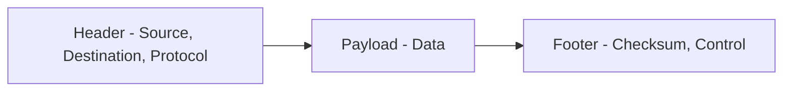
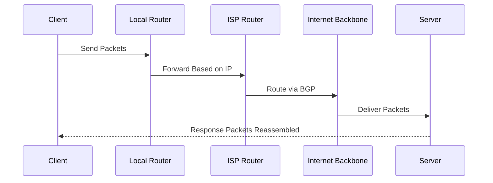

Data on the Internet travels in small units called **packets**. These packets are like digital envelopes that carry pieces of information from one device to another. The process of sending these packets across networks is known as **routing**. Routing ensures that packets find the best path to their destination, allowing for efficient and reliable communication across the vast expanse of the Internet.

## What Are Packets?

**Packets** are small chunks of data that are transmitted over a network. When you send an email, browse a website, or stream a video, the information is broken down into these packets. 

### Packet Structure

Each packet typically contains:

| Component        | Description                                      |
|------------------|--------------------------------------------------|
| Header           | Contains metadata such as source and destination IP addresses, packet number, and protocol information. |
| Payload          | The actual data being transmitted (e.g., part of an email or webpage). |
| Footer           | Contains error-checking information to ensure data integrity. |

Packets allow large amounts of data to be sent efficiently by breaking it into manageable pieces. This also helps in error detection and correction, as only the affected packets need to be resent if there’s an issue during transmission.

## How Routing Works

**Routing** is the process of determining the best path for packets to travel from their source to their destination. This is done by devices called **routers**, which are specialized computers that direct traffic on the Internet.

Each packets may travel through **multiple routers**, which act like digital post offices, forwarding packets based on their destination IP addresses. Routers use routing tables and protocols to decide the most efficient path for each packet.

Now let’s look at a simplified example of how a packet travels from your device to a web server:

In this example:

1. **Your Device**: When you request a webpage, your device creates packets containing the request data.
2. **Local Router**: The packets are sent to your local router, which forwards them
3. **ISP Router**: The local router sends the packets to your Internet Service Provider (ISP) router.
4. **Regional Network**: The ISP router forwards the packets through regional networks.
5. **Internet Backbone Router**: The packets reach the Internet backbone, where they are routed through high-capacity networks.
6. **Destination Server**: Finally, the packets arrive at the destination server, which processes the request and sends back the requested data in packets.

## How Routers Decide the Path

Routers use various algorithms and protocols to determine the best path for packets. Routers use **routing tables** that contain information about the network topology and the best routes to different IP addresses. They also use **routing protocols** to share information with other routers and update their routing tables.

### Common Routing Protocols

| Protocol | Type | Purpose |
| --------- | ---- | -------- |
| **RIP (Routing Information Protocol)** | Interior | Uses hop count to determine path |
| **OSPF (Open Shortest Path First)** | Interior | Chooses the fastest route based on link cost |
| **BGP (Border Gateway Protocol)** | Exterior | Manages routing between large networks (ISPs) |

:::info
**BGP** is what keeps the global Internet connected. It allows different ISPs to exchange routing information, ensuring that packets can travel across various networks worldwide.
:::

## Example: Visiting a Website

When you visit **https://codeharborhub.github.io**, here’s what happens behind the scenes:

1. Your browser sends a request to your **router**.  
2. The router forwards it to your **ISP** (Internet Service Provider).  
3. The ISP routes packets through various **networks and routers**.  
4. Each router uses **IP headers** to forward packets toward the destination.  
5. The server receives all packets and **reassembles** them into the webpage.

## Packet Fragmentation and Reassembly

Sometimes, networks have limits on how large a packet can be (called the **MTU — Maximum Transmission Unit**). If a packet is too large, it’s **fragmented** into smaller pieces.

When all fragments arrive, the destination system **reassembles them** in the correct order using sequence numbers.

| Concept | Description |
| -------- | ------------ |
| **Fragmentation** | Breaking large packets into smaller pieces |
| **Reassembly** | Combining fragments back into the original message |
| **Sequence Numbers** | Help identify the correct order |

## Reliability and Error Handling

The **TCP protocol** ensures packet delivery by:
* Assigning sequence numbers  
* Acknowledging received packets (ACK)  
* Retransmitting lost packets  
* Verifying integrity via checksums  

This is why even if some packets get lost or delayed, your webpage still loads perfectly once all packets arrive.

## Key Takeaways

* **Packets** are the building blocks of Internet communication.  
* **Routers** decide how these packets travel based on IP addresses and routing protocols.  
* **BGP** powers global routing between Internet providers.  
* **TCP/IP** ensures reliable delivery through sequencing and error checking.  
* The system’s **decentralized nature** makes the Internet scalable and resilient.

Understanding packets and routing is crucial to grasping how the Internet functions. This knowledge helps appreciate the complexity and efficiency of modern digital communication.