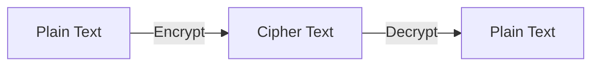
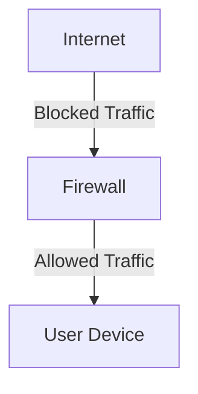

Internet security is the **foundation of safe communication** and data transfer online. Every time you log in, make a payment, or send a message, multiple security layers work behind the scenes to protect your information.

## What Is Internet Security?

**Internet security** refers to the set of technologies, protocols, and practices designed to **protect data** and **secure communication** over networks. It ensures that data sent between clients and servers remains **private, authentic, and intact**.

:::info
Think of Internet security as a digital shield that guards your information from hackers, eavesdroppers, and malicious software.
:::

Common threats include:
* Malware and viruses  
* Phishing attacks  
* Data interception (Man-in-the-Middle)  
* Unsecured public Wi-Fi usage  

## Core Principles of Cybersecurity

| Principle | Description |
| ---------- | ------------ |
| **Confidentiality** | Ensures that information is only accessible to authorized users (e.g., via encryption). |
| **Integrity** | Prevents unauthorized alteration of data during transmission. |
| **Availability** | Keeps systems and data accessible to authorized users when needed. |

These three are known as the **CIA Triad**, forming the foundation of security design. They work together to provide a comprehensive security framework.

## Encryption: Protecting Your Data

**Encryption** converts readable data (plaintext) into an unreadable format (ciphertext).  
Only users with the correct **decryption key** can restore the original message.

Example:
* When you access a website with **HTTPS**, your browser and server exchange data in an **encrypted** form, using protocols like **TLS (Transport Layer Security)**.

:::info
Encryption is like sending a locked box — only the person with the key can open it and read the contents.
:::

## Authentication and Authorization

Two terms often confused but very different:

| Term | Description | Example |
| ------ | ------------ | -------- |
| **Authentication** | Verifying the identity of a user or system. | Logging in with a username and password. |
| **Authorization** | Granting permission to access resources based on identity. | Accessing your email inbox after logging in. |

To enhance security, many systems implement **Multi-Factor Authentication (MFA)**, requiring two or more verification methods (e.g., password + SMS code).

:::info
Authentication is like showing your ID to prove who you are, while authorization is like getting a ticket to enter a concert after your ID is verified.

**Key Differences:**
* Authentication = *who you are*; 
* Authorization = *what you can do*.
:::

## Firewalls and Network Protection

A **firewall** acts as a **barrier** between your device or network and potential external threats. It filters incoming and outgoing traffic based on defined security rules.

Types of Firewalls:
* **Packet Filtering Firewall** – Filters data packets based on IP and port.
* **Proxy Firewall** – Acts as an intermediary between users and the web.
* **Next-Gen Firewall (NGFW)** – Uses deep packet inspection and AI-based analysis.

## Safe Browsing Practices

Here are simple but effective steps to stay safe online:

* [X] Always use **HTTPS websites**  
* [X] Keep your **software and browsers updated**  
* [X] Avoid clicking on **suspicious links**  
* [X] Use **strong, unique passwords** (or a password manager)  
* [X] Enable **Two-Factor Authentication (2FA)**  
* [X] Be cautious when using **public Wi-Fi**  

## Example: Why HTTPS Is Safer

Let’s see the difference in data transfer:

| Protocol | Encryption | Data Safety | Example |
| -------- | ----------- | ------------ | -------- |
| **HTTP** | None | Data can be intercepted | `http://example.com` |
| **HTTPS** | Encrypted with TLS | Data is protected end-to-end | `https://example.com` |

So, when you see a 🔒 lock in your browser, it means your connection is **secured with encryption**.

:::info
Using HTTPS is like sending a letter in a sealed envelope instead of a postcard — only the intended recipient can read it.
:::

## Key Takeaways

* Security ensures **confidentiality, integrity, and availability** of data.  
* **Encryption** protects your data in transit.  
* **Authentication** and **authorization** verify identity and access.  
* **Firewalls** and **HTTPS** safeguard your network and browsing.  
* Practicing **safe online habits** is the first line of defense.

Stay informed and proactive about your Internet security to enjoy a safer online experience!