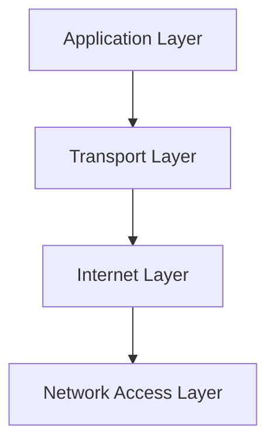
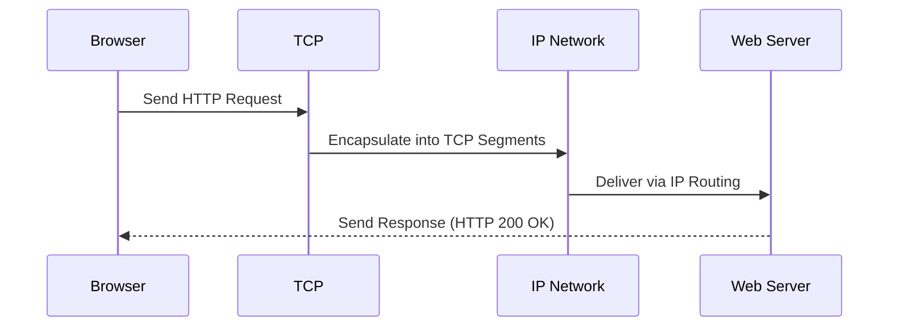

The **TCP/IP model** is the backbone of modern networking — a layered framework that defines how data is transmitted, routed, and received across the Internet. It ensures that billions of devices can communicate **efficiently and reliably**, regardless of their hardware or location.

:::info
Every byte of data that crosses the Internet follows the TCP/IP model quietly making global communication possible.
:::

## What Is the TCP/IP Model?

**TCP/IP** stands for **Transmission Control Protocol / Internet Protocol**. It’s a **set of communication rules (protocols)** that allow computers to connect and exchange data across networks from your home Wi-Fi to global Internet backbones.

While there are other models (like the OSI model), TCP/IP is the **practical implementation** that powers the Internet today.

## The Four Layers of the TCP/IP Model

Unlike the seven-layer OSI model, TCP/IP has **four layers**, each responsible for a specific part of data transmission.

### 1. Application Layer

This is the **topmost layer** where user-facing applications and services operate. It provides protocols that applications use to communicate with users and the network.

**Responsibilities:**
* Provides services like web browsing, email, and file transfer  
* Defines protocols for application-specific communication

**Common Protocols:**
* **HTTP/HTTPS** – Web browsing  
* **DNS** – Domain resolution  
* **FTP** – File transfer  
* **SMTP/IMAP** – Email

### 2. Transport Layer

This layer ensures **reliable data transfer** between devices. It manages how data is broken into smaller packets and reassembled at the destination.

**Responsibilities:**
* Manages data segmentation and reassembly  
* Handles flow control and error detection

**Key Protocols:**
* **TCP (Transmission Control Protocol)** – Reliable, connection-oriented communication  
* **UDP (User Datagram Protocol)** – Faster, connectionless transmission (used in streaming, gaming)

### 3. Internet Layer

This layer is responsible for **addressing and routing** packets across networks. It ensures that data finds its way from the source to the destination. This layer determines **how data packets find their way** from source to destination across multiple networks.

**Responsibilities:**
* Logical addressing (IP addresses)  
* Routing and path selection  

**Key Protocols:**
* **IP (Internet Protocol)** – Defines packet structure and addressing  
* **ICMP (Internet Control Message Protocol)** – Error reporting (e.g., ping)  
* **ARP (Address Resolution Protocol)** – Maps IP to MAC addresses

### 4. Network Access Layer

The **foundation layer** that handles the physical transmission of data. It defines how data is sent over various physical media.

**Responsibilities:**
* Defines how bits are sent over cables, Wi-Fi, or fiber  
* Includes drivers, hardware interfaces, and local network protocols  

**Common Technologies:**
* **Ethernet**, **Wi-Fi**, **Bluetooth**, **PPP**

## Example: Sending a Web Request

Let’s see how the TCP/IP model works when you visit a website like **https://codeharborhub.github.io**

| Step | Layer | Example Activity |
| ---- | ------ | ---------------- |
| 1 | **Application Layer** | Browser sends an HTTP request |
| 2 | **Transport Layer** | TCP ensures the request arrives intact |
| 3 | **Internet Layer** | IP routes the packet to the correct server |
| 4 | **Network Access Layer** | Data travels physically via Ethernet/Wi-Fi |

## How TCP/IP and OSI Relate

| OSI Model (7 Layers) | TCP/IP Model (4 Layers) |
| --------------------- | ------------------------ |
| Application, Presentation, Session | **Application** |
| Transport | **Transport** |
| Network | **Internet** |
| Data Link, Physical | **Network Access** |

While OSI provides a **conceptual** model, TCP/IP defines a **real-world implementation**.

## Key Takeaways

* **TCP/IP** is the protocol suite that drives the Internet.  
* It has **four layers**, each handling a different part of communication.  
* **TCP** ensures reliability; **IP** handles addressing and routing.  
* Understanding TCP/IP helps you grasp how devices truly "talk" on the Internet.