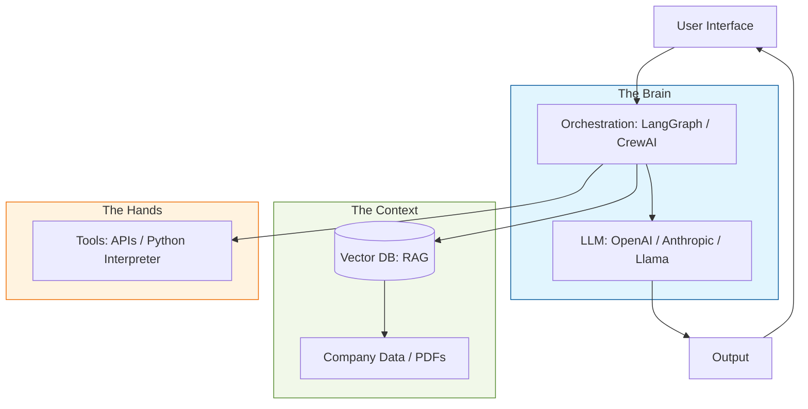

In 2026, the role of an **AI Engineer** has diverged from a traditional **Data Scientist**. While Data Scientists focus on research and training models ($loss$ functions and gradients), AI Engineers focus on **implementing** those models into scalable, reliable products.

This roadmap outlines the essential skills required to build "Agentic" and "Cognitive" applications.

## Phase 1: Foundations (The AI "Brain")
Before building agents, you must understand the engine that powers them.

* **LLM Fundamentals:** Understand Tokenization, Context Windows, and Temperature.
* **Prompt Engineering:** Master techniques like **Chain-of-Thought (CoT)** and **Few-Shot Prompting**.
* **Model Selection:** Know when to use "Frontier Models" (GPT-4o, Claude 3.5) vs. "Local Models" (Llama 3.x, Mistral) via **Ollama**.

## Phase 2: Retrieval Augmented Generation (RAG)
LLMs have a knowledge cutoff. RAG allows them to "talk" to your private data.

* **Embeddings:** Understanding how to turn text into vectors.
* **Vector Databases:** Learning tools like **Pinecone**, **Weaviate**, or **ChromaDB**.
* **Hybrid Search:** Combining semantic search with traditional keyword search (BM25).
* **Advanced RAG:** Implementing **Reranking**, **Query Expansion**, and **Small-to-Big Retrieval**.

## Phase 3: AI Agents & Autonomy
This is the core of modern AI Engineering—moving from static chat to active doing.

* **Tool Use:** Implementing **Function Calling** so models can use APIs and Databases.
* **Reasoning Loops:** Mastering the **ReAct** (Reason + Act) pattern.
* **Agent Frameworks:** Gaining proficiency in **LangChain**, **LangGraph**, or **CrewAI**.
* **Memory Systems:** Building short-term and long-term memory for persistent agents.

## Phase 4: The AI Stack

The following diagram illustrates the modern architecture an AI Engineer must manage.

## Phase 5: Evaluation & LLMOps

Building an AI app is easy; making it reliable is hard.

* **Evaluation (Evals):** Using frameworks like **Ragas** or **Arize Phoenix** to measure hallucinations.
* **Observability:** Tracking traces and costs using **LangSmith** or **Weights & Biases**.
* **Guardrails:** Implementing **NeMo Guardrails** or **Pydantic Program** to ensure structured, safe outputs.

## The 2026 Skill Matrix

| Skill Area | Beginner | Professional |
| --- | --- | --- |
| **Coding** | Python Basics | Async Python & FastAPI |
| **Data** | CSV/JSON handling | Vector Databases & SQL |
| **Deployment** | Streamlit apps | Docker, Kubernetes, & Serverless AI |
| **Logic** | Simple Chatbots | Multi-Agent Orchestration |

## How to Start Today

1. **Build a CLI Agent:** Create a Python script that uses an LLM to manage your local file system (e.g., "Find all PDFs and summarize them").
2. **Master RAG:** Build a "Chat with your Documentation" tool using a Vector DB.
3. **Deploy:** Put an agentic API behind a **FastAPI** endpoint and containerize it with **Docker**.

## References

* **Andrej Karpathy:** [Intro to Large Language Models](https://www.youtube.com/watch?v=DzjkBMFhNj_g)
* **Chip Huyen:** [Operationalizing Machine Learning](https://huyenchip.com/mlops/)
* **DeepLearning.ai:** [AI Engineering Specialization](https://www.deeplearning.ai/)

---

**This roadmap is your guide to the future of software development. Are you ready to build the next generation of autonomous systems?**