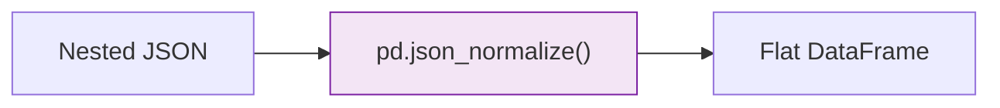

**JSON (JavaScript Object Notation)** is a lightweight, text-based format for storing and transporting data. While CSVs are perfect for simple tables, JSON excels at representing **hierarchical** or **nested** data—where one observation might contain lists or other sub-observations.

## 1. JSON Syntax vs. Python Dictionaries

JSON structure is almost identical to a Python dictionary. It uses key-value pairs and supports several data types:

* **Objects:** Enclosed in `{}` (Maps to Python `dict`).
* **Arrays:** Enclosed in `[]` (Maps to Python `list`).
* **Values:** Strings, Numbers, Booleans (`true`/`false`), and `null`.

```json
{
  "user_id": 101,
  "metadata": {
    "login_count": 5,
    "tags": ["premium", "active"]
  },
  "is_active": true
}

```

## 2. Why JSON is Critical for ML

### A. Natural Language Processing (NLP)

Text data often comes with complex metadata (author, timestamp, geolocation, and nested entity tags). JSON allows all this info to stay bundled with the raw text.

### B. Configuration Files

Most ML frameworks use JSON (or its cousin, YAML) to store **Hyperparameters**.

```json
{
  "model": "ResNet-50",
  "learning_rate": 0.001,
  "optimizer": "Adam"
}

```

### C. API Responses

As discussed in the [APIs section](/tutorial/machine-learning/data-engineering-basics/data-collection/apis), almost every web service returns data in JSON format.

## 3. The "Flattening" Problem

Machine Learning models (like Linear Regression or XGBoost) require **flat** 2D arrays (Rows and Columns). They cannot "see" inside a nested JSON object. Data engineers must **Flatten** or **Normalize** the data.



**Example in Python:**

```python
import pandas as pd
import json

raw_json = [
    {"name": "Alice", "info": {"age": 25, "city": "NY"}},
    {"name": "Bob", "info": {"age": 30, "city": "SF"}}
]

# Flattens 'info' into 'info.age' and 'info.city' columns
df = pd.json_normalize(raw_json)

```

## 4. Performance Trade-offs

| Feature | JSON | CSV | Parquet |
| --- | --- | --- | --- |
| **Flexibility** | **Very High** (Schema-less) | Low (Fixed Columns) | Medium (Evolving Schema) |
| **Parsing Speed** | Slow (Heavy string parsing) | Medium | **Very Fast** |
| **File Size** | Large (Repeated Keys) | Medium | Small (Binary) |

:::note
In a JSON file, the key (e.g., `"user_id"`) is repeated for every single record, which wastes a lot of disk space compared to CSV.
:::

## 5. JSONL: The Big Data Variant

Standard JSON files require you to load the entire file into memory to parse it. For datasets with millions of records, we use **JSONL (JSON Lines)**.

* Each line in the file is a separate, valid JSON object.
* **Benefit:** You can stream the file line-by-line without crashing your RAM.

```text
{"id": 1, "text": "Hello world"}
{"id": 2, "text": "Machine Learning is fun"}

```

## 6. Best Practices for ML Engineers

1. **Validation:** Use JSON Schema to ensure the data you're ingesting hasn't changed structure.
2. **Encoding:** Always use `UTF-8` to avoid character corruption in text data.
3. **Compression:** Since JSON is text-heavy, always use `.gz` or `.zip` when storing raw JSON files to save up to 90% space.

## References for More Details

* **[Python `json` Module](https://docs.python.org/3/library/json.html):** Learning `json.loads()` and `json.dumps()`.

* **[Pandas `json_normalize` Guide](https://pandas.pydata.org/docs/reference/api/pandas.json_normalize.html):** Mastering complex flattening of API data.

---

JSON is the king of flexibility, but for "Big Data" production environments where speed and storage are everything, we move to binary formats.