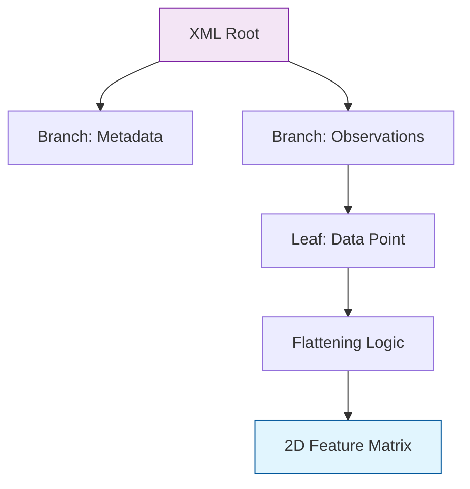

**XML** is a markup language that defines a set of rules for encoding documents in a format that is both human-readable and machine-readable. While JSON has largely replaced XML for web APIs, XML remains a cornerstone in industrial systems and **Object Detection** datasets.

## 1. Anatomy of an XML Document

XML uses a tree-like structure consisting of **tags**, **attributes**, and **content**.

```xml
<annotation>
    <filename>image_01.jpg</filename>
    <size>
        <width>640</width>
        <height>480</height>
    </size>
    <object>
        <name>cat</name>
        <bndbox>
            <xmin>100</xmin>
            <ymin>120</ymin>
            <xmax>250</xmax>
            <ymax>300</ymax>
        </bndbox>
    </object>
</annotation>

```

## 2. XML in Machine Learning: Use Cases

### A. Computer Vision (Pascal VOC)

One of the most famous datasets in ML history, **Pascal VOC**, uses XML files to store the coordinates of bounding boxes for image classification and detection.

### B. Enterprise Data Integration

Many older banking, insurance, and manufacturing systems exchange data exclusively via XML over SOAP (Simple Object Access Protocol).

### C. Configuration & Metadata

XML is often used to store metadata for scientific datasets where complex, nested relationships must be strictly defined by a **Schema (XSD)**.

## 3. Parsing XML in Python

Because XML is a tree, we don't read it like a flat file. We "traverse" the tree using libraries like `ElementTree` or `lxml`.

```python
import xml.etree.ElementTree as ET

tree = ET.parse('annotation.xml')
root = tree.getroot()

# Accessing specific data
filename = root.find('filename').text
for obj in root.findall('object'):
    name = obj.find('name').text
    print(f"Detected object: {name}")

```

## 4. XML vs. JSON

| Feature | XML | JSON |
| --- | --- | --- |
| **Metadata** | Supports Attributes + Elements | Only Key-Value pairs |
| **Strictness** | High (Requires XSD validation) | Low (Flexible) |
| **Size** | Verbose (Closing tags increase size) | Compact |
| **Readability** | High (Document-centric) | High (Data-centric) |

## 5. The Challenge: Deep Nesting

Just like [JSON](/tutorial/machine-learning/data-engineering-basics/data-formats/json), XML is hierarchical. To use it in a standard ML model (like a Random Forest), you must **Flatten** the tree into a table.



## 6. Best Practices

1. **Use `lxml` for Speed:** The built-in `ElementTree` is fine for small files, but `lxml` is significantly faster for processing large datasets.
2. **Beware of "XML Bombs":** Malicious XML files can use entity expansion to crash your parser (DoS attack). Use **defusedxml** if you are parsing untrusted data from the web.
3. **Schema Validation:** Always validate your XML against an `.xsd` file if available to ensure your ML pipeline doesn't break due to a missing tag.


## References for More Details

* **[Python ElementTree Documentation](https://docs.python.org/3/library/xml.etree.elementtree.html):** Learning the standard library approach.
* **[Pascal VOC Dataset Format](https://www.google.com/search?q=http://host.robots.ox.ac.uk/pascal/VOC/):** Seeing how XML is used in real-world ML projects.

---

XML completes our look at "Text-Based" formats. While these are great for humans to read, they are slow for machines to process. Next, we look at the high-speed binary formats used in Big Data.