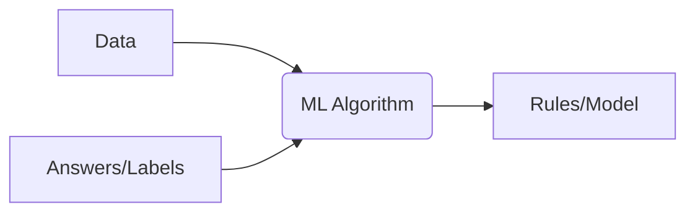

Machine Learning is a subset of Artificial Intelligence (AI) that focuses on building systems capable of learning patterns and making decisions or predictions directly from data, rather than following static, explicitly programmed instructions.

## The Formal Definition

A widely accepted, formal definition of Machine Learning was provided by computer scientist **Tom M. Mitchell** in 1997:

> A computer program is said to learn from **Experience ($E$)** with respect to some **Task ($T$)** and some **Performance measure ($P$)**, if its performance on $T$, as measured by $P$, improves with experience $E$.

Let's break down this concept with a simple example: **Spam Filtering**.

| Component | Description | Spam Filtering Example |
| :--- | :--- | :--- |
| **Task ($T$)** | The problem the ML system is trying to solve. | Classifying an email as "Spam" or "Not Spam (Ham)". |
| **Experience ($E$)** | The data the ML system uses to train itself. | A large dataset of historical emails labeled as either spam or ham. |
| **Performance ($P$)** | A metric used to evaluate the system's success. | **Accuracy:** The percentage of emails correctly classified. |

:::tip
The core idea is that the program's ability to classify new, unseen emails gets better the more labeled examples it processes. The program *learns* the rules itself.
:::

## ML vs. Traditional Programming

This is the most crucial concept when starting out. Machine Learning fundamentally shifts the paradigm of software development.


<Tabs>
  <TabItem value="traditional" label="Traditional Programming" default>

  In traditional programming, you (the programmer) write explicit **Rules** (algorithms, logic, conditions) that process **Data** to produce an **Answer**.

  ```mermaid
  graph LR
      A[Data] --> B(Rules/Program);
      B --> C[Answer];
  ```

**Example (Temperature Conversion):**
You explicitly write the formula: `Fahrenheit = (Celsius * 9/5) + 32`. The computer executes this static rule.

</TabItem>
<TabItem value="ml" label="Machine Learning">

In Machine Learning, you feed the system the **Data** and the desired **Answers** (Labels), and the system autonomously generates the **Rules** (the Model/Algorithm) that maps the input to the output.



**Example (Predicting House Price):**
You feed it past house data (size, location) and the final sale price. The ML algorithm creates a complex mathematical model (the "Rule") that predicts the price of a *new* house based on its features.

</TabItem>
</Tabs>

## Key Characteristics of Machine Learning

  * **Data-Driven:** ML models require vast amounts of high-quality data to learn effectively.
  * **Automatic Pattern Discovery:** The system discovers hidden patterns, correlations, and rules in the data without human intervention.
  * **Generalization:** A good ML model can accurately predict or classify data it has never seen before (its performance improves with experience $E$).
  * **Iterative Process:** Developing an ML model is a cyclical process of data collection, training, evaluation, and refinement.

## Where is ML Used?

Machine Learning is the engine behind many everyday technologies:

| Domain | Application | ML Task |
| :--- | :--- | :--- |
| **E-commerce** | Recommendation Systems (e.g., "People who bought X also bought Y") | Classification / Ranking |
| **Healthcare** | Tumor detection in X-rays or MRIs | Image Segmentation / Classification |
| **Finance** | Fraud detection in credit card transactions | Anomaly Detection / Classification |
| **Speech** | Voice assistants (Siri, Alexa) | Natural Language Processing (NLP) |
| **Transportation**| Self-driving cars | Computer Vision / Reinforcement Learning |