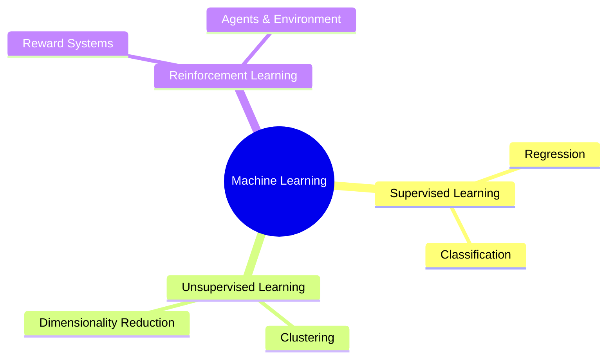

Welcome to the **CodeHarborHub Machine Learning Tutorial**! This is your official gateway into the transformative world of Artificial Intelligence, data analysis, and predictive modeling.

:::info
Machine Learning is not just about complex algorithms; it is about building systems that learn from data to make decisions or predictions *without* being explicitly programmed for every outcome.
:::

## Why Machine Learning Now?

The demand for ML skills is soaring across every industry—from finance and healthcare to entertainment and autonomous technology. By learning ML, you are gaining one of the most valuable and future-proof skill sets in the 21st century.

### What You Will Learn

This tutorial provides a complete, structured roadmap to transform you into a proficient ML practitioner. By the end, you will master:

1.  **Foundations:** The mathematical and statistical bedrock of ML.
2.  **Core Algorithms:** Implementing models like Linear Regression, Support Vector Machines, and K-Means.
3.  **Deep Learning:** Building advanced Neural Networks (CNNs, RNNs, Transformers).
4.  **Practical Workflow:** Handling real-world data, evaluating models, and deploying solutions (MLOps).
5.  **Coding:** Writing efficient, production-ready Python code using libraries like NumPy, Pandas, and Scikit-learn.

## Tutorial Structure Overview

This curriculum is designed as a deep, sequential progression. We move from the absolute basics (Math and Programming) to advanced deployment strategies.

<Tabs>
  <TabItem value="foundation" label="Foundations" default>
    ### The Bedrock of ML
    This initial stage ensures you have the solid academic footing required for understanding the algorithms.

    * **Mathematics:** Linear Algebra (Vectors, Matrices, Tensors) and Calculus (Derivatives, Gradients). For instance, the **Gradient Descent** optimization algorithm relies heavily on the partial derivative concept:
        $$
        \theta_{j} := \theta_{j} - \alpha \frac{\partial}{\partial \theta_{j}} J(\theta)
        $$
    * **Statistics & Probability:** Concepts like probability distributions, conditional probability, and data visualization.
    * **Programming Fundamentals:** Mastering Python, NumPy, and Pandas.
  </TabItem>
  <TabItem value="core_ml" label="ML & Deep Learning Core">
    ### Algorithms and Architectures
    Here, you start building models and diving into neural networks.

    * **ML Core:** Supervised, Unsupervised, and Reinforcement Learning paradigms.
    * **Data Engineering:** Preprocessing data, handling missing values, and the critical step of **Feature Engineering**.
    * **Deep Learning:** Understanding Perceptrons, Backpropagation, and specialized networks (CNNs for images, RNNs/Transformers for text).
  </TabItem>
  <TabItem value="advanced_ml" label="Advanced & Production">
    ### Real-World Application
    The final stage focuses on specialized fields and moving models into production.

    * **NLP:** Tokenization, Embeddings, and Attention Mechanisms for text processing.
    * **Explainable AI (XAI):** Tools like LIME and SHAP to interpret complex model decisions.
    * **MLOps:** The engineering discipline of deploying, monitoring, and maintaining ML models in a reliable and reproducible way (CI/CD, Model Versioning).
  </TabItem>
</Tabs>

---

## The Machine Learning Engineer Role

Understanding the role helps you align your learning goals.

| Aspect | ML Engineer | AI Engineer |
| :--- | :--- | :--- |
| **Primary Focus** | Production-level implementation, deployment, MLOps, scalability, data pipelines. | Research, development of novel AI models (especially Deep Learning/Generative AI), fine-tuning large models. |
| **Core Skills** | Python, Cloud (AWS/Azure/GCP), Docker, CI/CD, Scikit-learn, TensorFlow/PyTorch, **Data Engineering**. | Strong math/research background, Deep Learning frameworks, model optimization, **State-of-the-Art** techniques. |
| **Goal** | Make models reliably work in production at scale. | Create new intelligence capabilities or highly specialized models. |

:::success
This tutorial provides a strong foundation for **both** roles, with a dedicated focus on the practical implementation skills needed for the **ML Engineer** track.
:::

## Types of Machine Learning

<Tabs>
  <TabItem value="Supervised Learning" label="Supervised Learning" default>
    Learn from labeled data (input → correct output).  
    Examples:  
    * House price prediction  
    * Spam detection  
    * Disease prediction  .
  </TabItem>

  <TabItem value="Unsupervised Learning" label="Unsupervised Learning">
    Find hidden patterns in data without labels.  
    Examples:  
    * Customer segmentation  
    * Anomaly detection  
    * Data clustering 
  </TabItem>

  <TabItem value="Reinforcement Learning" label="Reinforcement Learning">      
    Learn through rewards and penalties.  
    Examples:  
    * Robotics  
    * Game AI  
    * Autonomous vehicles 
  </TabItem>
</Tabs>  

## Tools You Will Use

<Tabs>
  <TabItem value="python" label="Python" default>
    Python is the primary language for ML due to its simplicity and rich ecosystem.
  </TabItem>

  <TabItem value="libraries" label="Libraries">
    - NumPy  
    - Pandas  
    - Matplotlib / Seaborn  
    - Scikit-Learn  
    - TensorFlow  
    - PyTorch
  </TabItem>

  <TabItem value="notebooks" label="Notebooks">
    Jupyter Notebooks help you write code, visualize results, and document your workflow.
  </TabItem>
</Tabs>

## Ready to Begin?

Start by learning the fundamental definition of Machine Learning and the core concepts that define this field.