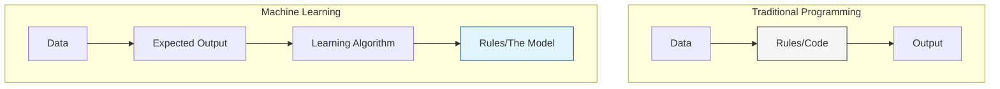
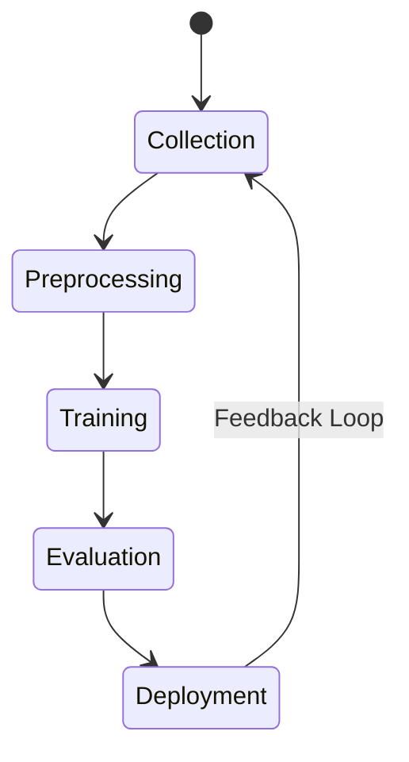

At its simplest, **Machine Learning (ML)** is the field of study that gives computers the ability to learn without being explicitly programmed. Instead of a human writing a thousand "if-then" statements, we provide an algorithm with data, and the algorithm "finds" the patterns itself.

## 1. The Paradigm Shift

To understand ML, we must compare it to **Traditional Programming**.

### Traditional Programming
In traditional software engineering, a human provides the **Rules** (code) and the **Data**. The computer follows the rules to produce an **Output**.

### Machine Learning
In ML, we provide the **Data** and the **Output** (labels). The computer analyzes these to produce the **Rules** (the Model).

## 2. The Three Main Types of Learning

Machine Learning is generally divided into three main categories based on how the agent "learns."

### A. Supervised Learning

The model is trained on **labeled data**. You give it inputs and the correct answers. It’s like a student learning with a teacher who corrects their homework.

* **Regression:** Predicting a continuous number (e.g., Home prices).
* **Classification:** Predicting a category (e.g., Is this email Spam or Not Spam?).

### B. Unsupervised Learning

The model is given **unlabeled data** and must find hidden structures or patterns on its own. There is no "teacher."

* **Clustering:** Grouping customers by similar buying habits.
* **Association:** Finding that people who buy bread also tend to buy butter.

### C. Reinforcement Learning (RL)

The model (agent) learns by interacting with an environment. It receives **rewards** for good actions and **penalties** for bad ones. It’s how AI learns to play chess or drive autonomous cars.

## 3. The Core Ingredients of ML

Every Machine Learning problem requires three components:

1. **The Dataset:** High-quality, representative data.
2. **The Features:** The specific attributes or variables the model looks at (e.g., mileage, year, and brand for a car).
3. **The Algorithm:** The mathematical process used to find patterns (e.g., Linear Regression, Neural Networks).

## 4. The Lifecycle of an ML Project

Building a model isn't just writing code; it's a circular process:

1. **Define the Goal:** What are we trying to predict?
2. **Data Collection:** Gathering raw information.
3. **Data Preprocessing:** Cleaning and scaling (what you learned in the [Data Engineering module](/tutorial/category/data-engineering-basics)).
4. **Model Training:** Feeding data to the algorithm.
5. **Evaluation:** Testing the model on data it hasn't seen before.
6. **Deployment:** Putting the model into a real-world app.

## 5. When NOT to use Machine Learning

ML is powerful, but it isn't always the right tool. Avoid ML if:

* You have very little data.
* The problem can be solved with simple, static logic.
* You need 100% mathematical certainty (ML is probabilistic, not deterministic).

## References for More Details

* **[Elements of AI (Free Course)](https://www.elementsofai.com/):** A non-technical conceptual deep dive.

* **[Google Machine Learning Glossary](https://developers.google.com/machine-learning/glossary):** Quickly looking up confusing terminology.

---

**Now that you understand the "Big Picture," let's look at the most fundamental math behind almost every predictive model.**