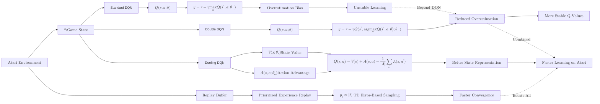

**Deep Q-Networks (DQN)** represent the fusion of Reinforcement Learning and Deep Neural Networks. While standard [Q-Learning](/tutorial/docs/machine-learning/machine-learning-core/reinforcement-learning/q-learning) uses a table to store values, DQN uses a **Neural Network** to approximate the Q-value function.

This advancement allowed RL agents to handle environments with high-dimensional state spaces, such as raw pixels from a video game screen.

## 1. Why Deep Learning for Q-Learning?

In a complex environment, the number of possible states is astronomical. 
* **Atari 2600:** A $210 \times 160$ pixel screen with 128 colors has more possible states than there are atoms in the universe.
* **The Solution:** Instead of a table, we use a Neural Network ($Q_\theta$) that takes a **State** as input and outputs the predicted **Q-values** for all possible actions.

## 2. The Two "Secret Ingredients" of DQN

Standard neural networks struggle with RL because the data is highly correlated (sequential frames in a game are nearly identical). To fix this, DQN introduced two revolutionary concepts:

### A. Experience Replay
Instead of learning from the current experience immediately, the agent saves its experiences $(s, a, r, s')$ in a **Replay Buffer**. During training, we sample a **random batch** of these experiences.
* **Benefit:** It breaks the correlation between consecutive samples and allows the model to "re-learn" from past successes and failures multiple times.

### B. Target Networks
In standard Q-Learning, the "target" we are chasing changes every time we update the weights. This is like a dog chasing its own tail. 
* **The Fix:** We maintain two networks:
    1. **Policy Network:** The one we are constantly training.
    2. **Target Network:** A frozen copy of the Policy Network used to calculate the "target" value. We only update this copy every few thousand steps.

## 3. The DQN Mathematical Objective

The loss function for DQN is the squared difference between the **Target Q-value** and the **Predicted Q-value**:

$$
L(\theta) = E \left[ \left( \underbrace{r + \gamma \max_{a'} Q_{\theta^{-}}(s', a')}_{\text{Target (Target Network)}} - \underbrace{Q_{\theta}(s, a)}_{\text{Prediction (Policy Network)}} \right)^2 \right]
$$

Where:

* **$\theta$**: Weights of the Policy Network.
* **$\theta^{-}$**: Weights of the Target Network (frozen).
* **$r$**: Reward received after taking action $a$ in state $s$.
* **$\gamma$**: Discount factor for future rewards.

## 4. The DQN Workflow

```mermaid
graph LR
    ENV["$$\text{Environment}$$"]

    ENV --> S["$$s_t$$<br/>$$\text{Current State}$$"]

    S --> NET["$$Q(s,a;\theta)$$<br/>$$\text{Online Q-Network}$$"]

    NET --> ACT["$$\varepsilon\text{-greedy Policy}a_t=\begin{cases} \text{random action} & \varepsilon \\ \arg\max_a Q(s_t,a;\theta) & 1-\varepsilon \end{cases}$$"]

    ACT --> ENV

    ENV --> R["$$r_t,\ s_{t+1}$$"]

    R --> MEM["$$\text{Replay Buffer } \mathcal{D}$$"]

    MEM --> SAMPLE["$$\text{Sample Mini-batch}$$"]

    SAMPLE --> TARGET["$$y_t = r_t + \gamma \max_a Q(s_{t+1},a;\theta^-)$$"]

    TARGET --> LOSS["$$\mathcal{L}(\theta) = \mathbb{E}\left[(y_t - Q(s_t,a_t;\theta))^2\right]$$"]

    LOSS --> GRAD["$$\nabla_\theta \mathcal{L}$$"]

    GRAD --> UPDATE["$$\theta \leftarrow \theta - \alpha \nabla_\theta \mathcal{L}$$"]

    UPDATE --> NET

    NET -.->|"$$\text{Periodically Copy}$$"| TNET["$$\theta^-$$<br/>$$\text{Target Network}$$"]


```



## 5. Implementation logic (PyTorch-style)

```python
# The DQN Model
class DQN(nn.Module):
    def __init__(self, state_dim, action_dim):
        super(DQN, self).__init__()
        self.net = nn.Sequential(
            nn.Linear(state_dim, 128),
            nn.ReLU(),
            nn.Linear(128, action_dim)
        )

    def forward(self, x):
        return self.net(x)

# Training Step
def train_step():
    # 1. Sample random batch from replay buffer
    states, actions, rewards, next_states, dones = buffer.sample(batch_size)

    # 2. Get current Q-values from Policy Network
    current_q = policy_net(states).gather(1, actions)

    # 3. Get maximum Q-values for next states from Target Network
    with torch.no_grad():
        next_q = target_net(next_states).max(1)[0]
        target_q = rewards + (gamma * next_q * (1 - dones))

    # 4. Minimize the Loss
    loss = F.mse_loss(current_q, target_q.unsqueeze(1))
    optimizer.zero_grad()
    loss.backward()
    optimizer.step()

```

## 6. Beyond DQN

While DQN was a massive breakthrough, it has been improved by:

* **Double DQN:** Reduces the tendency to overestimate Q-values.
* **Dueling DQN:** Separates the calculation of state value and action advantage.
* **Prioritized Experience Replay:** Samples "important" experiences (those with high error) more frequently.



## References

* **Mnih et al. (2015):** "Human-level control through deep reinforcement learning" (The original Nature paper).
* **DeepLizard RL Series:** Excellent visual tutorials on DQN mechanics.

---

**DQN is great for discrete actions (like buttons on a controller). But how do we handle continuous actions, like the pressure applied to a gas pedal?**