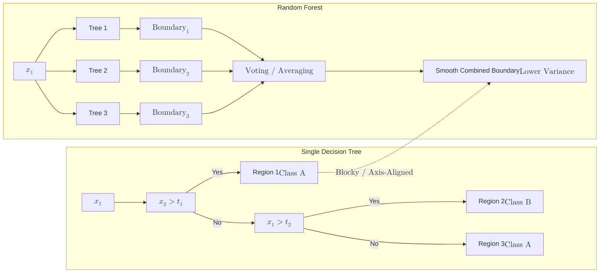

A **Random Forest** is an **Ensemble Learning** method that operates by constructing a multitude of [Decision Trees](../decision-trees) during training. For classification tasks, the output of the random forest is the class selected by most trees (majority voting).

The fundamental philosophy of Random Forest is that **a group of "weak learners" can come together to form a "strong learner."**

## 1. The Core Mechanism: Bagging

Random Forest uses a technique called **Bootstrap Aggregating**, or **Bagging**, to ensure that the trees in the forest are different from one another.

1.  **Bootstrapping:** The algorithm creates multiple random subsets of the training data. It does this by sampling with replacement (meaning the same row can appear multiple times in one subset).
2.  **Feature Randomness:** When splitting a node, the algorithm doesn't look at *all* available features. Instead, it picks a random subset of features. This ensures the trees aren't all looking at the same "obvious" patterns.
3.  **Aggregating:** Each tree makes a prediction. The forest takes all those predictions and picks the most popular one.

## 2. Why is Random Forest Better than a Single Tree?

A single Decision Tree is highly sensitive to the specific data it was trained on (High Variance). If you change the data slightly, the tree might look completely different.

Random Forest solves this by **averaging the errors**. While individual trees might overfit to certain noise in their specific bootstrap sample, the "noise" cancels out when you combine 100+ trees, leaving only the true underlying pattern.



## 3. Key Hyperparameters

* **n_estimators:** The number of trees in the forest. Generally, more trees are better, but they increase computational cost.
* **max_features:** The size of the random subsets of features to consider when splitting a node.
* **bootstrap:** Whether to use bootstrap samples or the entire dataset to build trees.
* **oob_score:** "Out-of-Bag" score. This allows the model to be validated using the data points that were *not* picked during the bootstrapping process for a specific tree.

## 4. Feature Importance

One of the greatest features of Random Forest is its ability to tell you which variables were most important in making predictions. It calculates how much the "Gini Impurity" decreases across all trees for a specific feature.

## 5. Implementation with Scikit-Learn

```python
from sklearn.ensemble import RandomForestClassifier

# 1. Initialize the Forest
# n_estimators=100 is a common starting point
rf = RandomForestClassifier(n_estimators=100, max_depth=10, random_state=42)

# 2. Train the ensemble
rf.fit(X_train, y_train)

# 3. Predict
y_pred = rf.predict(X_test)

# 4. Check Feature Importance
importances = rf.feature_importances_

```

## 6. Pros and Cons

| Advantages | Disadvantages |
| --- | --- |
| **Robustness:** Highly resistant to overfitting compared to single trees. | **Complexity:** Harder to visualize or explain than a single tree (the "Black Box" problem). |
| **Handles Missing Data:** Can maintain accuracy even when a large proportion of data is missing. | **Performance:** Can be slow to train on very large datasets with thousands of trees. |
| **No Scaling Needed:** Like Decision Trees, it is scale-invariant. | **Size:** The model files can become quite large in memory. |

## References for More Details

* **[Scikit-Learn Ensemble Module](https://scikit-learn.org/stable/modules/ensemble.html%23forests-of-randomized-trees):** Learning about variations like `ExtraTreesClassifier`.

---

**Random Forests use "Bagging" to build trees in parallel. But what if we built trees one after another, with each tree learning from the mistakes of the previous one?**