**DBSCAN** (Density-Based Spatial Clustering of Applications with Noise) is a powerful clustering algorithm that views clusters as high-density regions separated by low-density regions. Unlike [K-Means](/tutorial/docs/machine-learning/machine-learning-core/unsupervised-learning/clustering/kmeans), DBSCAN does not require you to specify the number of clusters in advance and can find clusters of **arbitrary shapes**.

## 1. How it Works: Core, Border, and Noise

DBSCAN classifies every data point into one of three categories based on its local neighborhood:

1.  **Core Points:** A point is a "Core Point" if it has at least `min_samples` within a distance of `eps` (epsilon) around it.
2.  **Border Points:** A point that has fewer than `min_samples` within `eps`, but is reachable from a Core Point.
3.  **Noise (Outliers):** Any point that is neither a Core Point nor a Border Point. These are ignored by the clustering process.

## 2. Key Hyperparameters

DBSCAN's performance depends almost entirely on two parameters:

* **`eps` (Epsilon):** The maximum distance between two samples for one to be considered as in the neighborhood of the other. 
    * *Too small:* Most data will be labeled as noise.
    * *Too large:* Clusters will merge into one giant blob.
* **`min_samples`:** The number of samples in a neighborhood for a point to be considered a core point.
    * Higher values are better for noisy datasets.

## 3. Handling Arbitrary Shapes

While K-Means and Hierarchical clustering struggle with non-spherical data, DBSCAN excels at finding "natural" shapes like rings, crescents, or nested structures.

```mermaid
graph LR
    X["$$X = \{x_1, x_2, \dots, x_n\}$$<br/>$$\text{Non-Spherical Data (Moons / Circles)}$$"]

    X --> KM["K-Means"]

    KM --> K1["$$\text{Assumes Spherical Clusters}$$"]
    K1 --> K2["$$\min \sum_{i=1}^{k} \sum_{x \in C_i} \|x-\mu_i\|^2$$"]
    K2 --> K3["$$\text{Distance to Centroid}$$"]
    K3 --> K4["$$\text{Fails on Moons / Circles}$$"]
    K4 --> K5["$$\text{Forces Incorrect Boundaries}$$"]

    X --> DB["DBSCAN"]

    DB --> D1["$$\varepsilon\text{-Neighborhood}$$"]
    D1 --> D2["$$\text{MinPts Density Criterion}$$"]
    D2 --> D3["$$\text{Density-Based Clustering}$$"]
    D3 --> D4["$$\text{Finds Arbitrary Shapes}$$"]
    D4 --> D5["$$\text{Handles Noise + Outliers}$$"]
    D5 --> D6["$$\text{Works Well on Moons / Circles}$$"]

    K5 -.->|"$$\text{Comparison}$$"| D6
    
```



## 4. Implementation with Scikit-Learn

```python
from sklearn.cluster import DBSCAN
from sklearn.preprocessing import StandardScaler

# 1. DBSCAN is distance-based; scaling is CRITICAL
scaler = StandardScaler()
X_scaled = scaler.fit_transform(X)

# 2. Initialize and Fit
# eps is the radius, min_samples is the density threshold
dbscan = DBSCAN(eps=0.5, min_samples=5)
labels = dbscan.fit_predict(X_scaled)

# 3. Identifying Outliers
# In Scikit-Learn, noise points are assigned the label -1
n_outliers = list(labels).count(-1)
print(f"Number of outliers detected: {n_outliers}")

```

## 5. Pros and Cons

| Advantages | Disadvantages |
| --- | --- |
| **No K needed:** Automatically detects the number of clusters. | **Varying Densities:** Struggles if clusters have vastly different densities. |
| **Outlier Detection:** Naturally identifies noise; doesn't force outliers into clusters. | **Sensitive to eps:** Choosing the right epsilon can be difficult and data-dependent. |
| **Shape Flexible:** Can find clusters of any shape (even "clusters within clusters"). | **Distance Metric:** Effectiveness drops in very high-dimensional data (Curse of Dimensionality). |

## 6. Determining Epsilon: The K-Distance Plot

To find the "optimal" epsilon, engineers often use a **K-Distance Plot**. You calculate the distance to the  nearest neighbor for every point, sort them, and look for the "elbow." The distance at the elbow is usually a good starting point for `eps`.

## References for More Details

* **[Visualizing DBSCAN (Interactive)](https://www.naftaliharris.com/blog/visualizing-dbscan-clustering/):** Seeing exactly how the density-reachable logic unfolds point-by-point.

* **[Scikit-Learn DBSCAN Guide](https://scikit-learn.org/stable/modules/generated/sklearn.cluster.DBSCAN.html):** Understanding how to use different distance metrics (Manhattan, Cosine).

---

**Clustering reveals groups, but often we have too many dimensions to visualize them. How do we compress our data into 2D or 3D without losing the structure?**