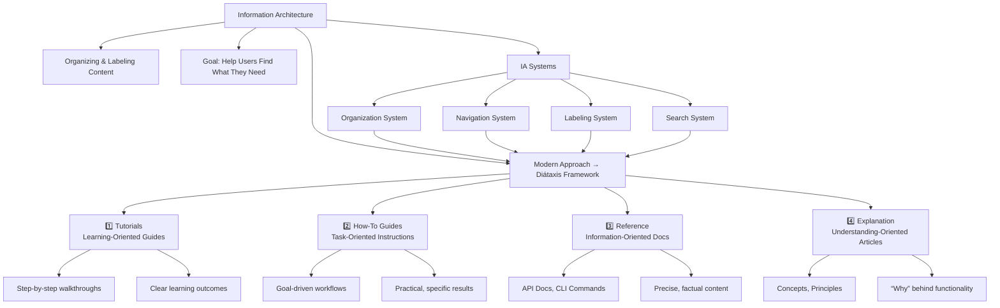

import { FaBook, FaWrench, FaCode, FaLightbulb } from 'react-icons/fa';
import thumbnail from '/img/tutorials/technical-writer/structure-and-formatting-cover.png';

<Image img={thumbnail} />

<br />

Writing well is only half the battle. If your users can't find the information they need, or if the content they find mixes learning materials with quick facts, your documentation fails.

**Information Architecture (IA)** is the practice of organizing and labeling content so users can find what they need. The most effective modern approach to technical documentation IA is the **Diátaxis Framework**.

:::tip Information Architecture Overview

<br />



In this diagram, you can see how the Diátaxis framework fits into the broader context of Information Architecture (IA) systems, which include organization, navigation, labeling, and search systems. Each of these systems plays a crucial role in ensuring that users can efficiently find and utilize the documentation they need.

:::

---

## The Diátaxis Framework: Structuring by Need

The Diátaxis framework is a systematic approach that categorizes all documentation into four distinct types, based on the user's current goal: **are they learning or working?** and **do they need action or cognition (knowledge)?**

This prevents the single biggest problem in documentation: mixing content types (e.g., putting a conceptual explanation inside an installation guide).

### The Four Quadrants of Diátaxis

| Type | User Goal | Content Focus | When to Use |
| :--- | :--- | :--- | :--- |
| **1. Tutorials** | **Learning.** The user is a beginner and wants to learn through practice. | Guided, step-by-step action; minimum theory. | Onboarding a new user; introducing a core workflow. |
| **2. How-To Guides** | **Working.** The user knows the product and wants to achieve a specific task (a "recipe"). | Solutions to real-world problems; task-focused steps. | Guides for a specific setup (e.g., "How to integrate with Slack"). |
| **3. Reference** | **Working.** The user needs a precise fact about the system for quick look-up. | Factual, structured information (API parameters, configuration options). | API Documentation, configuration tables, command line syntax. |
| **4. Explanation** | **Learning.** The user wants to understand the *why* and the *how* of the system deeply. | Theoretical and contextual discussion; big picture; rationale. | Design principles, architecture overviews, technical background. |

<div className="grid grid-cols-1 md:grid-cols-2 lg:grid-cols-4 gap-4 my-6">
    <SkillCard
        title="Tutorials"
        description="Learning by doing (Action + Study). You are the instructor."
        icon={<FaBook className="text-pink-500 w-6 h-6" />}
    />
    <SkillCard
        title="How-To Guides"
        description="Applying a skill to solve a problem (Action + Work). You are the chef with a recipe."
        icon={<FaWrench className="text-yellow-500 w-6 h-6" />}
    />
    <SkillCard
        title="Reference"
        description="Finding facts quickly (Cognition + Work). You are the dictionary."
        icon={<FaCode className="text-green-500 w-6 h-6" />}
    />
    <SkillCard
        title="Explanation"
        description="Deepening understanding (Cognition + Study). You are the thought leader."
        icon={<FaLightbulb className="text-blue-500 w-6 h-6" />}
    />
</div>

### Why This Matters

By adopting a framework like Diátaxis, you ensure that:

1.  **Users find the right content:** A new user looking to learn goes straight to 'Tutorials' instead of struggling with 'Reference' material.
2.  **Content stays focused:** Your 'How-To Guide' only contains steps (actions), not long conceptual paragraphs (explanations).
3.  **Your documentation is complete:** The framework acts as an audit checklist, exposing missing content types (e.g., "We have great tutorials, but no theoretical 'Explanation' for the architecture").

---

## Best Practices for Page-Level Formatting

While Diátaxis manages the macro-structure (folders and navigation), consistent formatting manages the micro-structure (the page itself).

### 1. Headings (H1, H2, H3)

Use headings to create a clear, nested hierarchy that helps users scan the page. The goal is that a user should be able to read only the headings and still understand the flow of the document.

* **H1 (`#`):** Used only once per page (the title).
* **H2 (`##`):** Main sections of the document.
* **H3 (`###`):** Sub-steps or topics within an H2 section.

### 2. Lists and Steps

Procedural information must be instantly digestible.

| Type | Purpose | Example |
| :--- | :--- | :--- |
| **Numbered Lists** | For sequential steps (e.g., installation). **Always use these for tasks.** | `1. Run the command.` `2. Check the output.` |
| **Bullet Lists** | For non-sequential items (e.g., features, requirements, key concepts). | `- Feature A` `- Feature B` |
| **Definition Lists** | Use tables or bold formatting for key/value pairs (e.g., API parameters). | **`--config`** | The path to your configuration file. |

### 3. Code Blocks and Inline Code

Code is the most critical element. Always use the appropriate formatting:

* **Inline Code:** Use single backticks (`` ` ``) for file names, variable names, command flags, and error messages.
    * *Example:* The variable `` `API_KEY` `` must be set in `` `config.env` ``.
* **Code Blocks:** Use triple backticks (`` ``` ``) with language highlighting for larger code examples, scripts, or command line output.
    * *Example:*
        ```bash
        # Always specify the language (e.g., bash, json, javascript)
        npm install codeharborhub-cli
        ```

:::tip Use Admonitions for Clarity
Use Docusaurus's built-in admonition blocks (like this tip box, or `:::note`, `:::warning`) to draw the user's attention to critical, supplementary, or conditional information without disrupting the main flow of the steps.
:::