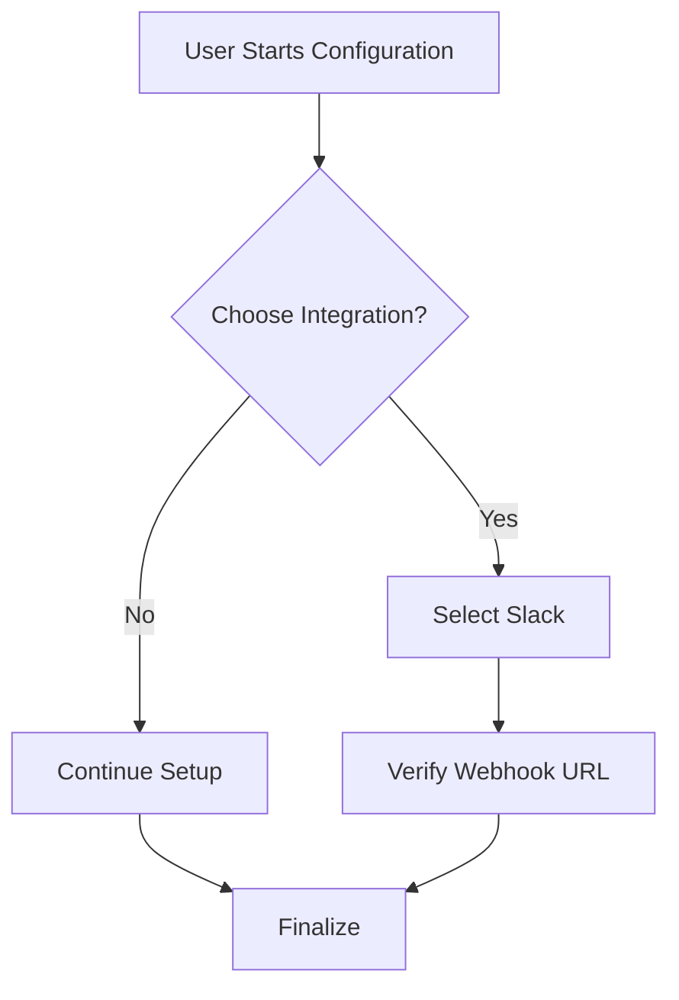

import { FaCamera, FaRulerCombined, FaArrowsAltH, FaVideo } from 'react-icons/fa';
import thumbnail from '/img/tutorials/technical-writer/visual-aids-cover.png';

<Image img={thumbnail} />

 

In technical documentation, **visual aids are not optional extras; they are part of the core content.**

When a reader encounters a complex step, a well-placed screenshot or diagram can confirm their progress, clarify ambiguous text, and reduce cognitive load. This is especially true for UI-heavy applications and complex system architectures.

---

## The Three Rules of Technical Graphics

Before adding any image, ask yourself: *Does this visual aid make the next step easier to understand?* If the answer is no, the image is distracting.

    <SkillCard
        title="1. Focus and Crop"
        description="Never use a full-desktop screenshot. Crop tightly to show *only* the relevant element (button, field, dialog box). The user should see immediately what they need to click."
        icon={<FaRulerCombined className="text-indigo-500 w-6 h-6" />}
    />
    <SkillCard
        title="2. Annotate Clearly"
        description="Use boxes, arrows, and circles to highlight the exact target. Never rely on just cropping; visually guide the user's eye with consistent colors."
        icon={<FaCamera className="text-red-500 w-6 h-6" />}
    />
    <SkillCard
        title="3. Maintain Consistency"
        description="Use the same aspect ratio, padding, color palette, and arrow style across all your documentation. Graphics should look like they belong to the same professional guide."
        icon={<FaArrowsAltH className="text-yellow-500 w-6 h-6" />}
    />

### Accessibility and Text Alternatives

Remember that images are invisible to screen readers and search engines. You **must** provide descriptive text for every image.

* **Alt Text (Required):** A concise, descriptive sentence that conveys the purpose of the image. (e.g., `alt="Screenshot of the Settings menu with the 'Advanced' tab selected."`)
* **Captions (Recommended):** Use captions for complex diagrams or figures that need a brief explanation directly beneath them.

:::warning Don't Forget Dark Mode
If your documentation supports a dark theme (like this site), ensure your screenshots are either theme-agnostic (using a neutral background color) or include separate versions optimized for light and dark modes to prevent a jarring visual experience.
:::

---

## When to Use Specific Visual Types

The type of visual you choose should align with the content structure (which we learned about in the previous section).

| Visual Type | Best Used In | Purpose | Tooling Examples |
| :--- | :--- | :--- | :--- |
| **Screenshot** | How-To Guides, Tutorials | To show the *result* of a step or the *next target* in a UI. | Snagit, ShareX, native OS tools. |
| **Flowchart/Diagram** | Explanations, Tutorials | To illustrate system architecture, data flow, or a decision tree. | Mermaid.js, PlantUML, Miro, Lucidchart. |
| **Code Snippets** | Reference, How-To Guides | While not a traditional "graphic," well-formatted code is a visual aid. | Code blocks with syntax highlighting. |
| **GIF / Short Video** | How-To Guides, Tutorials | For complex sequences of steps (e.g., drag-and-drop actions, filling out a form). | Loom, ScreenToGif. |

### Diagramming with Code

For technical documentation, relying on image files for diagrams has a major drawback: they are hard to update.

A modern, developer-centric alternative is using a diagramming language like **Mermaid.js** (which Docusaurus can easily support via a plugin). This allows you to define a flowchart or sequence diagram using simple markup, which then renders into a scalable, theme-aware SVG.

This approach treats your diagrams like code: they are versionable, easy to review, and maintain consistency automatically.